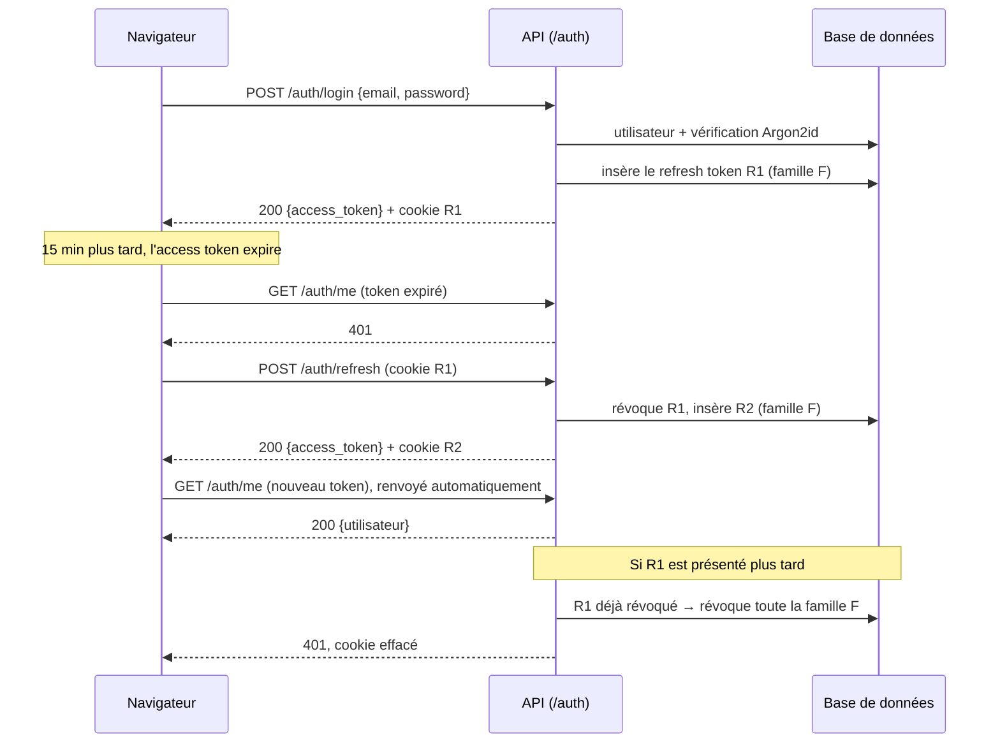

# Authentification

[English](authentication.md) | Français

Comment un utilisateur crée un compte et se connecte à TierList : ce qu'il voit, comment cela fonctionne techniquement, et où cela se trouve dans le code.

## 1. Vue fonctionnelle

### Ce que l'utilisateur peut faire

| Action               | Où                                                                         | Résultat                                                                                                        |
| -------------------- | -------------------------------------------------------------------------- | --------------------------------------------------------------------------------------------------------------- |
| Créer un compte      | `/register` : nom affiché, email, mot de passe                             | Le compte est créé et l'utilisateur est connecté tout de suite.                                                 |
| Se connecter         | `/login` : email, mot de passe                                             | L'utilisateur est connecté et renvoyé vers la page qu'il voulait ouvrir (l'accueil par défaut).                 |
| Rester connecté      | automatique                                                                | Recharger la page ou revenir plus tard (jusqu'à 30 jours d'inactivité) ne redemande pas le mot de passe.        |
| Se déconnecter       | bouton « Se déconnecter » de la page d'accueil                             | La session est fermée côté serveur : elle ne peut plus être réutilisée, même par quelqu'un qui l'aurait copiée. |
| Supprimer son compte | bouton « Supprimer mon compte » de la page d'accueil, puis le mot de passe | Le compte et toutes ses sessions sont effacés définitivement ; l'utilisateur est renvoyé vers `/login`.         |

Toutes les autres pages exigent une session : sans session, l'utilisateur est redirigé vers `/login`.

### Règles

- **Email** : adresse valide, unique et **insensible à la casse** (`Alice@Example.com` et `alice@example.com` sont le même compte). Il est enregistré en minuscules.
- **Mot de passe** : de 8 à 128 caractères. Aucune autre règle de composition : la longueur compte plus que les types de caractères.
- **Nom affiché** : de 1 à 50 caractères, espaces de début et de fin retirés.

### Messages

| Situation                                    | HTTP | Message affiché                                                    |
| -------------------------------------------- | ---- | ------------------------------------------------------------------ |
| Email déjà utilisé                           | 409  | `Cet email est déjà utilisé`                                       |
| Email inconnu **ou** mot de passe faux       | 401  | `Email ou mot de passe incorrect` (même message dans les deux cas) |
| Champ invalide                               | 422  | Message à côté du champ (ex. mot de passe trop court)              |
| Session expirée ou révoquée                  | 401  | L'utilisateur est renvoyé vers `/login`                            |
| Mot de passe faux à la suppression du compte | 403  | `Mot de passe incorrect` (le dialogue reste ouvert)                |

### Pas encore disponible

- Vérification de l'adresse email et « mot de passe oublié » (il faut un service d'envoi d'emails).
- Limitation des tentatives de connexion répétées (rate limiting).
- Connexion avec Google : prévue dans la pull request suivante.

## 2. Fonctionnement technique

### Deux tokens

| Token             | Format                                | Durée de vie                                                  | Conservé par le navigateur         | Envoyé                                                           |
| ----------------- | ------------------------------------- | ------------------------------------------------------------- | ---------------------------------- | ---------------------------------------------------------------- |
| **Access token**  | JWT signé en HS256 (`JWT_SECRET_KEY`) | 15 min (`ACCESS_TOKEN_TTL_MINUTES`)                           | En mémoire JavaScript uniquement   | En-tête `Authorization: Bearer <token>`, à chaque appel d'API    |
| **Refresh token** | Chaîne opaque aléatoire (256 bits)    | 30 jours (`REFRESH_TOKEN_TTL_DAYS`), renouvelé à chaque usage | Cookie `refresh_token`, `HttpOnly` | Automatiquement par le navigateur, uniquement vers `/api/auth/*` |

Pourquoi ce partage :

- L'**access token** est vérifié sans requête en base (signature et expiration). Comme il est court, un token volé ne sert que 15 minutes au plus. Il n'est jamais écrit dans `localStorage`, lisible par n'importe quel script injecté.
- Le **refresh token** est illisible par JavaScript (`HttpOnly`) et n'est stocké côté serveur **que sous forme de hash SHA-256**. Comme il est en base, il peut être **révoqué** : la déconnexion et la détection de vol prennent effet immédiatement, ce qu'un JWT seul ne permet pas.

Claims de l'access token : `sub` (identifiant de l'utilisateur), `type` (`access`), `iat`, `exp`, `auth_time` (heure de la connexion d'origine, conservée d'un rafraîchissement à l'autre ; servira à exiger une connexion récente pour les actions sensibles).

### Rotation des refresh tokens et détection de vol

Chaque connexion ouvre une **famille** de refresh tokens. Chaque rafraîchissement **révoque** le token utilisé et en émet un nouveau dans la même famille. Si un token déjà remplacé est présenté de nouveau, quelqu'un d'autre en détient une copie : toute la famille est révoquée, ce qui déconnecte à la fois le voleur et l'utilisateur.



Au chargement de la page, aucun access token n'est en mémoire : le frontend appelle `POST /auth/refresh`, et le cookie, s'il est encore valide, restaure la session.

### Endpoints

| Méthode et chemin     | Authentification               | Succès                                                  | Erreurs                                 |
| --------------------- | ------------------------------ | ------------------------------------------------------- | --------------------------------------- |
| `POST /auth/register` | —                              | `201` `TokenResponse` + cookie de refresh               | `409`, `422`                            |
| `POST /auth/login`    | —                              | `200` `TokenResponse` + cookie de refresh               | `401`, `422`                            |
| `POST /auth/refresh`  | cookie de refresh              | `200` `TokenResponse` + nouveau cookie de refresh       | `401` (cookie effacé)                   |
| `POST /auth/logout`   | cookie de refresh (facultatif) | `204`, famille révoquée, cookie effacé                  | —                                       |
| `GET /auth/me`        | Bearer                         | `200` `UserResponse`                                    | `401` (`WWW-Authenticate: Bearer`)      |
| `DELETE /auth/me`     | Bearer + corps `{password}`    | `204`, utilisateur et sessions supprimés, cookie effacé | `401`, `403` (mot de passe faux), `422` |

`TokenResponse` vaut `{access_token, token_type: "bearer", expires_in}` (en secondes). `UserResponse` vaut `{id, email, display_name, created_at}` ; le hash du mot de passe n'est jamais renvoyé.

### Cookie de refresh

`refresh_token=<token>; HttpOnly; Secure; SameSite=Strict; Path=/api/auth; Max-Age=2592000`

- `HttpOnly` : invisible pour JavaScript.
- `Secure` : HTTPS uniquement. Désactivé en local avec `AUTH_COOKIE_SECURE=false`, car le serveur de développement est en HTTP.
- `SameSite=Strict` : jamais envoyé par une requête venant d'un autre site, ce qui protège les routes à cookie contre le CSRF.
- `Path=/api/auth` : envoyé uniquement aux routes d'authentification, pas au reste de l'API. C'est le chemin **vu par le navigateur** : le proxy Vite transmet `/api/auth/...` au `/auth/...` du backend (`AUTH_COOKIE_PATH`).

Frontend et backend sont servis depuis la même origine (proxy Vite en développement) : aucune configuration CORS n'est nécessaire.

### Suppression de compte

La suppression est **définitive** (pas de suppression douce) : la ligne de `users` est supprimée, et la base efface ses refresh tokens grâce à `ON DELETE CASCADE` ; toutes les sessions du compte prennent donc fin d'un coup. Les access tokens déjà émis sont refusés eux aussi, car `get_current_user` ne trouve plus l'utilisateur.

Le mot de passe actuel est exigé : un access token volé ne suffit pas pour supprimer un compte. Un mot de passe faux renvoie `403`, pas `401` : l'utilisateur est bien authentifié, et une `401` pousserait le frontend à rafraîchir la session pour rien.

### Choix de sécurité

- Les **mots de passe** sont hachés avec **Argon2id** (`pwdlib`, paramètres recommandés). Le mot de passe en clair n'est jamais stocké ni journalisé.
- **Même réponse pour un email inconnu et un mot de passe faux** : même message, et un hash factice est tout de même vérifié quand l'email est inconnu, pour que le temps de réponse ne révèle pas quels emails ont un compte.
- **Algorithme JWT imposé** (HS256) au décodage : un token signé avec un autre algorithme, ou non signé (`alg: none`), est refusé.
- Les **logs** contiennent l'identifiant de l'utilisateur, jamais le mot de passe, les tokens ni l'email. Un refresh token rejoué est journalisé en avertissement.
- L'inscription révèle bien qu'un email est déjà pris (`409`) : sans vérification d'email, c'est le compromis habituel.

### Limites connues

- **Plusieurs onglets qui restaurent la session au même instant** (ex. réouverture du navigateur avec beaucoup d'onglets) peuvent présenter deux fois le même refresh token. Le second est traité comme un vol et la session est fermée : l'utilisateur se reconnecte. Dans un même onglet, les rafraîchissements sont mutualisés, donc cela ne peut pas arriver.
- Un access token reste valide jusqu'à son expiration (15 min) même après la déconnexion ; seul son renouvellement est bloqué.

## 3. Dans le code

### Backend (`backend/app/`)

| Couche        | Fichier                                                               | Contenu                                                                                                                                       |
| ------------- | --------------------------------------------------------------------- | --------------------------------------------------------------------------------------------------------------------------------------------- |
| Routes        | `api/routes/auth.py`                                                  | Les six routes `/auth` ; pose et efface le cookie de refresh ; traduit les erreurs du domaine en `HTTPException`.                             |
| Dépendances   | `api/dependencies.py`                                                 | `get_auth_service` et `get_current_user` (token Bearer → `User`, sinon 401).                                                                  |
| Schémas       | `schemas/auth.py`                                                     | `RegisterRequest`, `LoginRequest`, `TokenResponse`, `UserResponse`.                                                                           |
| Service       | `services/auth.py`                                                    | `AuthService` : inscription, connexion, rafraîchissement avec rotation et détection de vol, déconnexion. Possède les transactions (`commit`). |
| Repositories  | `repositories/users.py`, `repositories/refresh_tokens.py`             | Requêtes uniquement. Le refresh token est lu `FOR UPDATE` : deux rafraîchissements simultanés sont traités l'un après l'autre.                |
| Modèles       | `models/user.py`                                                      | `User` (table `users`), `RefreshToken` (table `refresh_tokens`, `ON DELETE CASCADE` vers `users`).                                            |
| Cryptographie | `core/security.py`                                                    | Fonctions pures : hachage Argon2id, création et décodage des JWT, génération et hachage des refresh tokens.                                   |
| Configuration | `core/config.py`                                                      | `JWT_SECRET_KEY`, `ACCESS_TOKEN_TTL_MINUTES`, `REFRESH_TOKEN_TTL_DAYS`, `AUTH_COOKIE_SECURE`, `AUTH_COOKIE_PATH`.                             |
| Migration     | `migrations/versions/93f9cc04b237_create_users_and_refresh_tokens.py` | Crée les deux tables.                                                                                                                         |

**Protéger un nouvel endpoint** : ajouter la dépendance `get_current_user`. La route reçoit alors l'utilisateur authentifié, et le schéma OpenAPI indique l'exigence du Bearer.

```python
from typing import Annotated

from fastapi import Depends

from app.api.dependencies import get_current_user
from app.models.user import User


@router.get("/tierlists")
def list_tierlists(user: Annotated[User, Depends(get_current_user)]) -> list[TierListResponse]:
    ...
```

### Frontend (`frontend/src/`)

| Fichier                                         | Contenu                                                                                                                                                                                                                                                                  |
| ----------------------------------------------- | ------------------------------------------------------------------------------------------------------------------------------------------------------------------------------------------------------------------------------------------------------------------------ |
| `api/client.ts`                                 | Access token en mémoire (`setAccessToken`), middleware qui ajoute `Authorization` et, sur une `401`, rafraîchit **une seule fois** (mutualisé entre requêtes simultanées) puis renvoie la requête ; `getFieldErrors` pour les messages 422.                              |
| `api/auth.ts`                                   | `register`, `login`, `logout`, `getMe`, `getCurrentUser` (restaure la session au chargement) et les hooks `useCurrentUser`, `useRegister`, `useLogin`, `useLogout`.                                                                                                      |
| `auth/RequireAuth.tsx`                          | Garde des routes : chargement, erreur, redirection vers `/login` (en mémorisant la page demandée) ou page privée.                                                                                                                                                        |
| `pages/LoginPage.tsx`, `pages/RegisterPage.tsx` | Formulaires avec champs étiquetés, erreurs par champ, message du backend, bouton désactivé pendant l'envoi.                                                                                                                                                              |
| `components/TextField.tsx`                      | Champ étiqueté dont l'erreur est reliée par `aria-describedby`.                                                                                                                                                                                                          |
| `components/DeleteAccountDialog.tsx`            | Bouton « Supprimer mon compte » et `<dialog>` natif (ouvert avec `showModal()` : le navigateur y piège le focus et le ferme avec Échap), qui demande le mot de passe. En cas de succès, la session et le cache des requêtes sont vidés et l'utilisateur va sur `/login`. |
| `App.tsx`                                       | Routes (`react-router`) : `/login`, `/register`, `/` privée, chemins inconnus redirigés vers `/`.                                                                                                                                                                        |

L'utilisateur courant est un **état serveur**, conservé dans le cache TanStack Query sous `['auth', 'me']` : pas de contexte React séparé. La connexion et l'inscription rafraîchissent cette entrée ; la déconnexion vide tout le cache.

Masquer des pages dans le frontend n'est qu'un confort : la vraie protection est la vérification de l'access token par le backend sur chaque route protégée.

### Tests

Décrits dans le [guide des tests](testing.fr.md) : `tests/test_security.py`, `tests/integration/test_auth.py` (backend), `src/api/client.test.ts`, `src/api/auth.test.ts`, `src/App.test.tsx`, `src/pages/*.test.tsx` et `src/components/DeleteAccountDialog.test.tsx` (frontend).
