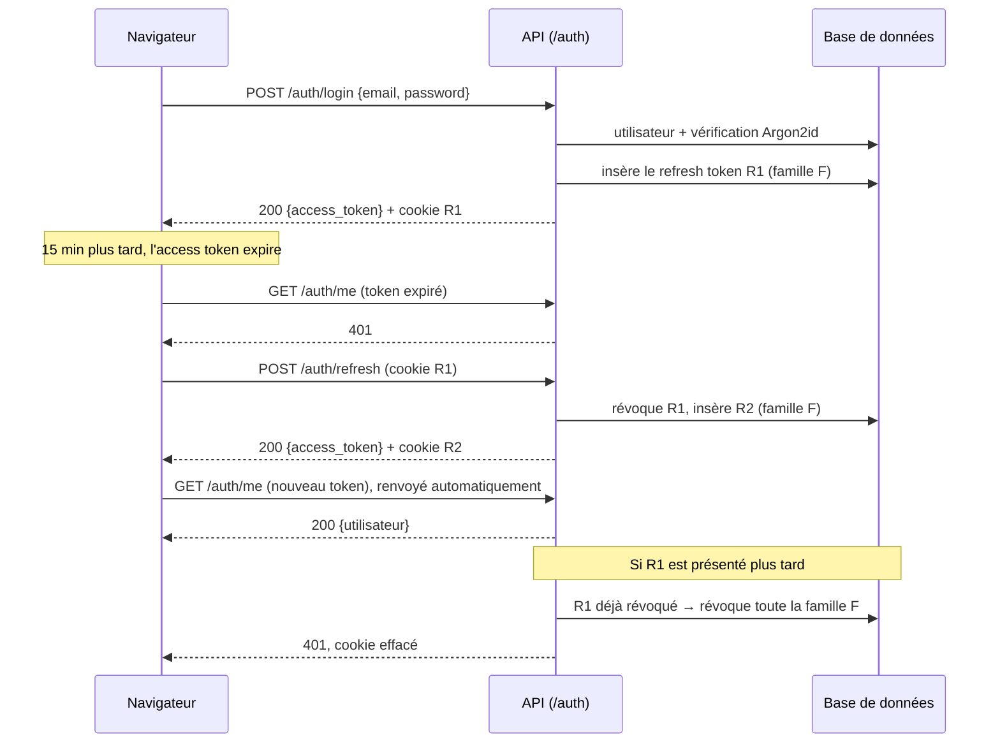
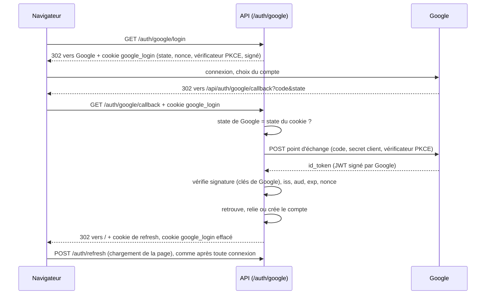

# Authentification

[English](authentication.md) | Français

Comment un utilisateur crée un compte et se connecte à TierList : ce qu'il voit, comment cela fonctionne techniquement, et où cela se trouve dans le code.

## 1. Vue fonctionnelle

### Ce que l'utilisateur peut faire

| Action                               | Où                                                                                                                                             | Résultat                                                                                                                                                                         |
| ------------------------------------ | ---------------------------------------------------------------------------------------------------------------------------------------------- | -------------------------------------------------------------------------------------------------------------------------------------------------------------------------------- |
| Créer un compte                      | `/register` : nom affiché, email, mot de passe                                                                                                 | Le compte est créé et l'utilisateur est connecté tout de suite. Un email avec un lien de confirmation est envoyé.                                                                |
| Confirmer l'adresse email            | lien reçu par email (`/verify-email?token=…`), puis « Confirmer mon adresse »                                                                  | L'adresse est confirmée. D'ici là, un bandeau de la page d'accueil propose de renvoyer l'email.                                                                                  |
| Réinitialiser un mot de passe oublié | lien « Mot de passe oublié ? » de `/login` → `/forgot-password` (email), puis le lien reçu par email (`/reset-password?token=…`)               | Le mot de passe est remplacé et **toutes les sessions sont fermées** ; l'utilisateur se connecte avec le nouveau. Un compte créé avec Google peut ainsi définir un mot de passe. |
| Se connecter                         | `/login` : email, mot de passe                                                                                                                 | L'utilisateur est connecté et renvoyé vers la page qu'il voulait ouvrir (l'accueil par défaut).                                                                                  |
| Se connecter avec Google             | lien « Continuer avec Google » de `/login` ou `/register`                                                                                      | La première fois, le compte est créé (ou relié au compte existant de même email, voir les règles de liaison) ; ensuite l'utilisateur est connecté.                               |
| Rester connecté                      | automatique                                                                                                                                    | Recharger la page ou revenir plus tard (jusqu'à 30 jours d'inactivité) ne redemande pas le mot de passe.                                                                         |
| Se déconnecter                       | bouton « Se déconnecter » de la page d'accueil                                                                                                 | La session est fermée côté serveur : elle ne peut plus être réutilisée, même par quelqu'un qui l'aurait copiée.                                                                  |
| Supprimer son compte                 | bouton « Supprimer mon compte » de la page d'accueil, puis le mot de passe (ou, pour un compte créé avec Google, une connexion Google récente) | Le compte et toutes ses sessions sont effacés définitivement ; l'utilisateur est renvoyé vers `/login`.                                                                          |

Toutes les autres pages exigent une session : sans session, l'utilisateur est redirigé vers `/login`.

### Règles

- **Email** : adresse valide, unique et **insensible à la casse** (`Alice@Example.com` et `alice@example.com` sont le même compte). Il est enregistré en minuscules.
- **Mot de passe** : au moins `PASSWORD_MIN_LENGTH` caractères (8 par défaut, un réglage du serveur), au plus 128. Aucune autre règle de composition : la longueur compte plus que les types de caractères. Un mot de passe trop court reçoit une `422` dont le message indique le minimum, ex. `Le mot de passe doit contenir au moins 8 caractères`, affiché sous le champ.
- **Nom affiché** : de 1 à 50 caractères, espaces de début et de fin retirés.
- **Confirmation de l'email** : elle n'est pas exigée pour utiliser l'application (l'utilisateur est connecté dès l'inscription) ; le lien est valable `EMAIL_VERIFICATION_TTL_HOURS` (24 h par défaut) et peut être renvoyé au plus une fois toutes les `EMAIL_COOLDOWN_SECONDS` (60 s par défaut). Les futures actions sensibles exigeront une adresse confirmée.
- **Réinitialisation du mot de passe** : la réponse est la même qu'un compte utilise l'adresse ou non ; le lien est valable `PASSWORD_RESET_TTL_MINUTES` (30 min par défaut), **ne sert qu'une fois**, et peut être demandé au plus une fois toutes les `EMAIL_COOLDOWN_SECONDS`.
- **Google** : un compte créé avec Google n'a pas de mot de passe et ne se connecte qu'avec Google. Son nom affiché vient du profil Google. Google n'est utilisé que s'il indique l'email comme **vérifié** ; un compte créé avec Google a une adresse confirmée.

### Messages

L'API renvoie un **code** d'erreur (voir [le format d'erreur](../backend/README.fr.md#12-format-derreur)) ; le frontend affiche le message correspondant à ce code, dans la langue de l'interface. Les messages ci-dessous sont les messages français ; les anglais sont dans `frontend/src/i18n/locales/en.ts`.

| Situation                                                                                                                    | HTTP | Code de l'API                              | Message affiché                                                                                           |
| ---------------------------------------------------------------------------------------------------------------------------- | ---- | ------------------------------------------ | --------------------------------------------------------------------------------------------------------- |
| Email déjà utilisé                                                                                                           | 409  | `email_already_registered`                 | `Cet email est déjà utilisé`                                                                              |
| Email inconnu **ou** mot de passe faux                                                                                       | 401  | `invalid_credentials`                      | `Email ou mot de passe incorrect` (même message dans les deux cas)                                        |
| Champ invalide                                                                                                               | 422  | `code` du champ (ex. `password_too_short`) | Message à côté du champ (ex. mot de passe trop court)                                                     |
| Session expirée ou révoquée                                                                                                  | 401  | `session_expired`                          | L'utilisateur est renvoyé vers `/login`                                                                   |
| Mot de passe faux à la suppression du compte                                                                                 | 403  | `incorrect_password`                       | `Mot de passe incorrect` (le dialogue reste ouvert)                                                       |
| Compte Google : dernière connexion plus ancienne que `RECENT_AUTHENTICATION_MAX_AGE_MINUTES` (5 par défaut) à la suppression | 403  | `reauthentication_required`                | `Reconnectez-vous avec Google pour confirmer la suppression`, avec un lien « Se reconnecter avec Google » |
| Connexion Google annulée                                                                                                     | —    | `?error=google_cancelled`                  | `Connexion avec Google annulée.` sur `/login`                                                             |
| Email Google non vérifié                                                                                                     | —    | `?error=google_email_not_verified`         | `Votre adresse Google n'est pas vérifiée : elle ne peut pas servir à vous connecter.`                     |
| Google non configuré sur le serveur                                                                                          | —    | `?error=google_unavailable`                | `La connexion avec Google n'est pas disponible pour le moment.`                                           |
| Tout autre échec de Google                                                                                                   | —    | `?error=google_failed`                     | `La connexion avec Google a échoué, veuillez réessayer.`                                                  |
| Lien invalide ou expiré (confirmation de l'email ou réinitialisation), ou lien de réinitialisation déjà utilisé              | 400  | `invalid_token`                            | `Ce lien est invalide ou a expiré.`                                                                       |

### Pas encore disponible

- Limitation des tentatives de connexion répétées (rate limiting) : prévue au niveau de l'hébergeur, avant le premier déploiement (voir le TODO).
- Fournisseurs d'identité autres que Google.

## 2. Fonctionnement technique

### Deux tokens

| Token             | Format                                | Durée de vie                                                  | Conservé par le navigateur         | Envoyé                                                           |
| ----------------- | ------------------------------------- | ------------------------------------------------------------- | ---------------------------------- | ---------------------------------------------------------------- |
| **Access token**  | JWT signé en HS256 (`JWT_SECRET_KEY`) | 15 min (`ACCESS_TOKEN_TTL_MINUTES`)                           | En mémoire JavaScript uniquement   | En-tête `Authorization: Bearer <token>`, à chaque appel d'API    |
| **Refresh token** | Chaîne opaque aléatoire (256 bits)    | 30 jours (`REFRESH_TOKEN_TTL_DAYS`), renouvelé à chaque usage | Cookie `refresh_token`, `HttpOnly` | Automatiquement par le navigateur, uniquement vers `/api/auth/*` |

Pourquoi ce partage :

- L'**access token** est vérifié sans requête en base (signature et expiration). Comme il est court, un token volé ne sert que 15 minutes au plus. Il n'est jamais écrit dans `localStorage`, lisible par n'importe quel script injecté.
- Le **refresh token** est illisible par JavaScript (`HttpOnly`) et n'est stocké côté serveur **que sous forme de hash SHA-256**. Comme il est en base, il peut être **révoqué** : la déconnexion et la détection de vol prennent effet immédiatement, ce qu'un JWT seul ne permet pas.

Claims de l'access token : `sub` (identifiant de l'utilisateur), `type` (`access`), `iat`, `exp`, `auth_time` (heure de la connexion d'origine, conservée d'un rafraîchissement à l'autre ; servira à exiger une connexion récente pour les actions sensibles).

### Rotation des refresh tokens et détection de vol

Chaque connexion ouvre une **famille** de refresh tokens. Chaque rafraîchissement **révoque** le token utilisé et en émet un nouveau dans la même famille. Si un token déjà remplacé est présenté de nouveau, quelqu'un d'autre en détient une copie : toute la famille est révoquée, ce qui déconnecte à la fois le voleur et l'utilisateur.



Au chargement de la page, aucun access token n'est en mémoire : le frontend appelle `POST /auth/refresh`, et le cookie, s'il est encore valide, restaure la session.

Chaque connexion **supprime aussi les refresh tokens expirés** de l'utilisateur : la table ne grossit pas indéfiniment, sans tâche planifiée. Les tokens révoqués sont gardés jusqu'à leur expiration : ce sont eux qui repèrent une réutilisation. Un token volé rejoué après son expiration est donc simplement refusé (`401`), sans révoquer sa famille ; il était de toute façon inutilisable.

### Réglages

Toutes les durées et règles qui peuvent changer selon l'environnement sont lues dans `backend/.env` (voir le README backend) : `ACCESS_TOKEN_TTL_MINUTES` (15), `REFRESH_TOKEN_TTL_DAYS` (30), `PASSWORD_MIN_LENGTH` (8), `RECENT_AUTHENTICATION_MAX_AGE_MINUTES` (5), `GOOGLE_LOGIN_ATTEMPT_TTL_MINUTES` (10), `GOOGLE_HTTP_TIMEOUT_SECONDS` (10), `EMAIL_VERIFICATION_TTL_HOURS` (24), `PASSWORD_RESET_TTL_MINUTES` (30), `EMAIL_COOLDOWN_SECONDS` (60). Les changer ne demande qu'un redémarrage du backend. Le frontend ne duplique pas `PASSWORD_MIN_LENGTH` : il affiche le message de la `422`.

### Endpoints

| Méthode et chemin                            | Authentification                                         | Succès                                                                                                                           | Erreurs                                                                     |
| -------------------------------------------- | -------------------------------------------------------- | -------------------------------------------------------------------------------------------------------------------------------- | --------------------------------------------------------------------------- |
| `POST /auth/register`                        | — (`language` facultatif : langue de l'email)            | `201` `TokenResponse` + cookie de refresh ; email de confirmation envoyé                                                         | `409`, `422`                                                                |
| `POST /auth/login`                           | —                                                        | `200` `TokenResponse` + cookie de refresh                                                                                        | `401`, `422`                                                                |
| `POST /auth/refresh`                         | cookie de refresh                                        | `200` `TokenResponse` + nouveau cookie de refresh                                                                                | `401` (cookie effacé)                                                       |
| `POST /auth/logout`                          | cookie de refresh (facultatif)                           | `204`, famille révoquée, cookie effacé                                                                                           | —                                                                           |
| `GET /auth/me`                               | Bearer                                                   | `200` `UserResponse`                                                                                                             | `401` (`WWW-Authenticate: Bearer`)                                          |
| `POST /auth/email/verification`              | Bearer + `{language}`                                    | `204` ; email renvoyé, sauf si l'adresse est confirmée ou si le précédent email est trop récent                                  | `401`                                                                       |
| `POST /auth/email/verify`                    | — + `{token}`                                            | `204`, adresse confirmée (une deuxième utilisation ne change rien)                                                               | `400` `invalid_token`, `422`                                                |
| `POST /auth/password/forgot`                 | — + `{email, language}`                                  | `204` dans tous les cas ; email de réinitialisation envoyé si un compte utilise l'adresse (sauf si le précédent est trop récent) | `422`                                                                       |
| `POST /auth/password/reset`                  | — + `{token, password}`                                  | `204`, mot de passe remplacé, toutes les sessions fermées, adresse confirmée                                                     | `400` `invalid_token`, `422` (ex. `password_too_short`)                     |
| `DELETE /auth/me`                            | Bearer + corps `{password}` (vide pour un compte Google) | `204`, utilisateur, sessions et identité Google supprimés, cookie effacé                                                         | `401`, `403` (mot de passe faux, ou connexion Google trop ancienne), `422`  |
| `GET /auth/google/login?next=delete-account` | —                                                        | `302` vers Google + cookie `google_login` (`next` facultatif)                                                                    | `302` vers `/login?error=google_unavailable` ; `422` pour tout autre `next` |
| `GET /auth/google/callback`                  | cookie `google_login`                                    | `302` vers `/` (ou `/?confirm=delete-account`) + cookie de refresh                                                               | `302` vers `/login?error=<code>`                                            |

`TokenResponse` vaut `{access_token, token_type: "bearer", expires_in}` (en secondes). `UserResponse` vaut `{id, email, display_name, has_password, email_verified, created_at}` ; le hash du mot de passe n'est jamais renvoyé.

### Cookie de refresh

`refresh_token=<token>; HttpOnly; Secure; SameSite=Strict; Path=/api/auth; Max-Age=2592000`

- `HttpOnly` : invisible pour JavaScript.
- `Secure` : HTTPS uniquement. Désactivé en local avec `AUTH_COOKIE_SECURE=false`, car le serveur de développement est en HTTP.
- `SameSite=Strict` : jamais envoyé par une requête venant d'un autre site, ce qui protège les routes à cookie contre le CSRF.
- `Path=/api/auth` : envoyé uniquement aux routes d'authentification, pas au reste de l'API. C'est le chemin **vu par le navigateur** : le proxy Vite transmet `/api/auth/...` au `/auth/...` du backend (`AUTH_COOKIE_PATH`).

Frontend et backend sont servis depuis la même origine (proxy Vite en développement) : aucune configuration CORS n'est nécessaire.

### Confirmation de l'email

- **Lien** : `{FRONTEND_BASE_URL}/verify-email?token=<JWT>`, envoyé par email ([guide des emails](emails.fr.md)). Le JWT (type `email_verification`, signé avec `JWT_SECRET_KEY`) contient l'identifiant de l'utilisateur et une **empreinte** de l'adresse (SHA-256 tronqué), jamais l'adresse elle-même : un JWT se lit sans la clé, et une URL peut finir dans des logs. Il n'est pas stocké : si l'adresse du compte change, l'empreinte ne correspond plus et le lien est refusé.
- **Confirmation au clic** : la page attend un clic sur « Confirmer mon adresse » avant d'appeler l'API, pour qu'un outil qui ouvre les liens des emails pour les analyser (antispam) ne confirme pas l'adresse à la place de l'utilisateur.
- **Renvoi** : `POST /auth/email/verification` n'envoie rien si l'adresse est déjà confirmée, ou si le précédent email date de moins de `EMAIL_COOLDOWN_SECONDS` (`users.verification_email_sent_at`) : cela évite d'inonder une boîte. La réponse est `204` dans tous les cas.
- **Comptes existants** (migration `fe4d7859b473`) : ceux reliés à Google sont confirmés, les autres non et peuvent redemander l'email.

### Réinitialisation du mot de passe

- **Même réponse pour tous** : `POST /auth/password/forgot` répond `204` qu'un compte utilise l'adresse ou non, et l'email part en tâche de fond : ni la réponse ni sa durée ne révèlent qui est inscrit. La page affiche un message neutre (« Si un compte existe pour cette adresse… »).
- **Lien** : `{FRONTEND_BASE_URL}/reset-password?token=<JWT>`. Le JWT (type `password_reset`) contient l'identifiant de l'utilisateur et une **empreinte du mot de passe actuel** (HMAC-SHA256 du hash avec `JWT_SECRET_KEY`, tronqué). Dès que le mot de passe change, l'empreinte ne correspond plus : le lien **ne sert qu'une fois**, et tous les liens plus anciens deviennent inutilisables, sans rien stocker. Il est valable `PASSWORD_RESET_TTL_MINUTES` (30 min).
- **Après la réinitialisation** : le nouveau mot de passe suit les règles habituelles (`PASSWORD_MIN_LENGTH`) ; **toutes les sessions du compte sont fermées** (l'ancien mot de passe a pu être volé), y compris celle du navigateur utilisé, qui oublie sa session ; l'adresse devient confirmée, puisque ouvrir le lien prouve qu'on la possède.
- **Compte sans mot de passe** (créé avec Google) : le même parcours définit un mot de passe ; le compte garde sa connexion Google.
- **Fréquence** : au plus un email de réinitialisation toutes les `EMAIL_COOLDOWN_SECONDS` par compte (`users.password_reset_email_sent_at`) ; une demande trop rapprochée est ignorée, avec la même réponse.

### Suppression de compte

La suppression est **définitive** (pas de suppression douce) : la ligne de `users` est supprimée, et la base efface ses refresh tokens grâce à `ON DELETE CASCADE` ; toutes les sessions du compte prennent donc fin d'un coup. Les access tokens déjà émis sont refusés eux aussi, car `get_current_user` ne trouve plus l'utilisateur.

Le mot de passe actuel est exigé : un access token volé ne suffit pas pour supprimer un compte. Un mot de passe faux renvoie `403`, pas `401` : l'utilisateur est bien authentifié, et une `401` pousserait le frontend à rafraîchir la session pour rien.

Un compte créé avec Google n'a pas de mot de passe à redemander. Sa confirmation est une **connexion récente** : le claim `auth_time` de l'access token (heure de la connexion d'origine, conservée d'un rafraîchissement à l'autre) doit être plus récent que `RECENT_AUTHENTICATION_MAX_AGE_MINUTES` (5 minutes par défaut). Sinon l'API répond `403` ; le dialogue propose alors « Se reconnecter avec Google » (`/api/auth/google/login?next=delete-account`), et au retour la page d'accueil rouvre le dialogue de suppression (`/?confirm=delete-account`). L'identité Google est supprimée avec le compte (`ON DELETE CASCADE`).

### Connexion avec Google (OpenID Connect)

TierList est **client OpenID Connect** de Google : il ne délivre pas de tokens à d'autres applications. Google prouve seulement qui est l'utilisateur ; la session est ensuite la même qu'après une connexion par mot de passe (access token + cookie de refresh).



- Le **`state`** doit revenir à l'identique : il lie la réponse de Google à ce navigateur (protection CSRF).
- Le **`nonce`** est recopié par Google dans l'`id_token` : un token émis pour une autre connexion est refusé.
- **PKCE** (`code_challenge` S256) : un code d'autorisation intercepté est inutilisable sans le vérificateur gardé dans le cookie.
- Le **cookie `google_login`** garde ces trois valeurs pendant `GOOGLE_LOGIN_ATTEMPT_TTL_MINUTES` (10 minutes par défaut), signées en JWT avec `JWT_SECRET_KEY` (le navigateur ne peut pas les modifier). Il est `HttpOnly`, limité à `/api/auth/google`, et `SameSite=Lax`, pas `Strict` : le retour depuis Google est une navigation venant d'un autre site, pour laquelle le navigateur n'enverrait pas un cookie `Strict`. Il est effacé dès qu'il a servi.
- L'**`id_token`** est vérifié avec les clés publiques de Google (JWKS, mises en cache) : algorithme RS256, émetteur `accounts.google.com`, audience `GOOGLE_CLIENT_ID`, expiration et nonce. `iat` et `exp` tolèrent 60 secondes d'écart d'horloge avec Google (`GOOGLE_ID_TOKEN_CLOCK_SKEW_SECONDS`) : sans cela, un token émis par une horloge de Google légèrement en avance sur la nôtre serait refusé comme « pas encore valide ».

**Retrouver le compte**, dans cet ordre :

1. l'identité Google (claim `sub`, stable même si l'email change) est déjà reliée : connexion à ce compte ;
2. sinon, un compte utilise déjà cet email : l'identité Google lui est reliée. Si l'adresse de ce compte n'a **jamais été confirmée**, son mot de passe est aussi **supprimé**, ses sessions sont fermées et l'adresse devient confirmée (voir plus bas) ;
3. sinon : un nouveau compte **sans mot de passe** est créé.

Les cas 2 et 3 exigent `email_verified` de Google : sinon n'importe qui pourrait prendre le contrôle d'un compte existant, ou réserver l'adresse de quelqu'un d'autre.

Deux **premières connexions simultanées** (double clic, deux onglets) peuvent arriver toutes les deux aux cas 2 ou 3. Les contraintes d'unicité (`users.email`, `(provider, provider_subject)` de `oauth_accounts`) ne laissent écrire que l'une d'elles ; l'autre est annulée et retentée une fois, et retrouve alors le compte au cas 1 ou 2.

**Pourquoi le mot de passe d'un compte non confirmé est supprimé** : sans cela, quelqu'un pourrait s'inscrire avec l'adresse Gmail d'une autre personne, avant elle, et choisir le mot de passe. Quand la vraie propriétaire se connecterait ensuite avec Google, son identité Google serait reliée à ce compte, dont l'autre personne connaît le mot de passe : les deux partageraient le compte (_prise de contrôle préalable_). Google prouve qui possède l'adresse : le mot de passe posé par quelqu'un d'autre, et les sessions ouvertes avec lui, sont donc supprimés. Une vraie propriétaire qui s'était inscrite avec un mot de passe peut toujours se connecter avec Google. Les identités sont enregistrées dans la table `oauth_accounts` (`provider`, `provider_subject`, uniques ensemble).

**Configurer Google** (Google Cloud Console → API et services → Identifiants) :

1. Configurer l'écran de consentement OAuth (nom de l'application, email d'assistance ; scopes `openid`, `email`, `profile`).
2. Créer un **ID client OAuth** de type **Application Web**.
3. Ajouter l'**URI de redirection autorisé** exactement égal à `GOOGLE_REDIRECT_URI` : `http://localhost:5173/api/auth/google/callback` en développement, l'URL HTTPS en production.
4. Copier l'ID client et le secret dans `backend/.env` (`GOOGLE_CLIENT_ID`, `GOOGLE_CLIENT_SECRET`), puis redémarrer le backend.

Sans ces deux variables, le lien « Continuer avec Google » ramène sur `/login` avec « La connexion avec Google n'est pas disponible pour le moment. »

### Choix de sécurité

- Les **mots de passe** sont hachés avec **Argon2id** (`pwdlib`, paramètres recommandés). Le mot de passe en clair n'est jamais stocké ni journalisé.
- **Même réponse pour un email inconnu et un mot de passe faux** : même message, et un hash factice est tout de même vérifié quand l'email est inconnu, pour que le temps de réponse ne révèle pas quels emails ont un compte.
- **Algorithme JWT imposé** (HS256) au décodage : un token signé avec un autre algorithme, ou non signé (`alg: none`), est refusé.
- Les **logs** contiennent l'identifiant de l'utilisateur, jamais le mot de passe, les tokens ni l'email. Un refresh token rejoué est journalisé en avertissement.
- L'inscription révèle bien qu'un email est déjà pris (`409`) : le compromis habituel d'un formulaire d'inscription.

### Limites connues

- **Plusieurs onglets qui restaurent la session au même instant** (ex. réouverture du navigateur avec beaucoup d'onglets) peuvent présenter deux fois le même refresh token. Le second est traité comme un vol et la session est fermée : l'utilisateur se reconnecte. Dans un même onglet, les rafraîchissements sont mutualisés, donc cela ne peut pas arriver.
- Un access token reste valide jusqu'à son expiration (15 min) même après la déconnexion ; seul son renouvellement est bloqué.

## 3. Dans le code

### Backend (`backend/app/`)

| Couche        | Fichier                                                                                                                                                                                                                                | Contenu                                                                                                                                                                                                                               |
| ------------- | -------------------------------------------------------------------------------------------------------------------------------------------------------------------------------------------------------------------------------------- | ------------------------------------------------------------------------------------------------------------------------------------------------------------------------------------------------------------------------------------- |
| Routes        | `api/routes/auth.py`                                                                                                                                                                                                                   | Les douze routes `/auth`, dont `/auth/google/login` et `/auth/google/callback` ; posent et effacent les cookies ; traduisent les erreurs du domaine en `AppHTTPException` (avec un `ErrorCode`) ou en redirections.                   |
| Dépendances   | `api/dependencies.py`                                                                                                                                                                                                                  | `get_auth_service`, `get_current_session` (token Bearer → utilisateur + `auth_time`, sinon 401), `get_current_user` (l'utilisateur seul) et `get_google_oauth_client` (`None` si Google n'est pas configuré).                         |
| Schémas       | `schemas/auth.py`                                                                                                                                                                                                                      | `RegisterRequest`, `LoginRequest`, `TokenResponse`, `UserResponse`, `EmailVerificationRequest`, `VerifyEmailRequest`, `ForgotPasswordRequest`, `ResetPasswordRequest` (le dernier partage la règle `NewPassword` avec l'inscription). |
| Service       | `services/auth.py`                                                                                                                                                                                                                     | `AuthService` : inscription, connexion, connexion Google (retrouver, relier ou créer), rafraîchissement avec rotation et détection de vol, déconnexion, suppression du compte. Possède les transactions (`commit`).                   |
| Client Google | `services/google_oauth.py`                                                                                                                                                                                                             | `GoogleLoginAttempt` (state, nonce, PKCE, cookie signé) et `GoogleOAuthClient` (URL d'autorisation, échange du code avec `httpx`, vérification de l'`id_token` avec le JWKS).                                                         |
| Repositories  | `repositories/users.py`, `repositories/refresh_tokens.py`, `repositories/oauth_accounts.py`                                                                                                                                            | Requêtes uniquement. Le refresh token est lu `FOR UPDATE` : deux rafraîchissements simultanés sont traités l'un après l'autre.                                                                                                        |
| Modèles       | `models/user.py`                                                                                                                                                                                                                       | `User` (table `users`, `password_hash` vide pour un compte Google), `RefreshToken` (`refresh_tokens`) et `OAuthAccount` (`oauth_accounts`), tous deux en `ON DELETE CASCADE` vers `users`.                                            |
| Cryptographie | `core/security.py`                                                                                                                                                                                                                     | Fonctions pures : hachage Argon2id, création et décodage des JWT, génération et hachage des refresh tokens.                                                                                                                           |
| Exceptions    | `exceptions/auth.py`, `exceptions/google.py`, `exceptions/http.py`                                                                                                                                                                     | Toutes les exceptions du domaine (`InvalidCredentialsError`, `InvalidRefreshTokenError`, `GoogleAuthError`…), levées par les services et traduites par les routes ; `AppHTTPException`, l'erreur HTTP qui porte le code d'erreur.     |
| Constantes    | `constants/auth.py`, `constants/google.py`, `constants/error_codes.py`, `constants/messages.py`                                                                                                                                        | Noms de cookies, types de tokens, longueurs, chemins du frontend, URL de Google, codes d'erreur de l'API (`ErrorCode`), messages de l'API pour les développeurs (en anglais).                                                         |
| Configuration | `core/config.py`                                                                                                                                                                                                                       | `JWT_SECRET_KEY`, `ACCESS_TOKEN_TTL_MINUTES`, `REFRESH_TOKEN_TTL_DAYS`, `AUTH_COOKIE_SECURE`, `AUTH_COOKIE_PATH`.                                                                                                                     |
| Migrations    | `migrations/versions/93f9cc04b237_create_users_and_refresh_tokens.py`, `95119a855a83_add_oauth_accounts_and_optional_.py`, `fe4d7859b473_add_email_verification_to_users.py`, `21df5503e778_add_password_reset_email_time_to_users.py` | Créent les tables ; la deuxième ajoute `oauth_accounts` et rend le mot de passe facultatif ; la troisième ajoute `email_verified_at` et `verification_email_sent_at` ; la quatrième ajoute `password_reset_email_sent_at`.            |

**Protéger un nouvel endpoint** : ajouter la dépendance `get_current_user`. La route reçoit alors l'utilisateur authentifié, et le schéma OpenAPI indique l'exigence du Bearer.

```python
from typing import Annotated

from fastapi import Depends

from app.api.dependencies import get_current_user
from app.models.user import User


@router.get("/tierlists")
def list_tierlists(user: Annotated[User, Depends(get_current_user)]) -> list[TierListResponse]:
    ...
```

### Frontend (`frontend/src/`)

| Fichier                                                       | Contenu                                                                                                                                                                                                                                                                                                                                                                                                                   |
| ------------------------------------------------------------- | ------------------------------------------------------------------------------------------------------------------------------------------------------------------------------------------------------------------------------------------------------------------------------------------------------------------------------------------------------------------------------------------------------------------------- |
| `api/client.ts`                                               | Access token en mémoire (`setAccessToken`), middleware qui ajoute `Authorization` et, sur une `401`, rafraîchit **une seule fois** (mutualisé entre requêtes simultanées) puis renvoie la requête.                                                                                                                                                                                                                        |
| `errors/apiError.ts`, `errors/googleError.ts`                 | `ApiError` (avec le `code` et les `params` de l'API), `getFieldErrors` (erreurs 422 par champ) et les fonctions qui traduisent un code d'erreur en message.                                                                                                                                                                                                                                                               |
| `constants/`                                                  | `auth.ts` (limites, chemin Google, routes de session, clé de cache), `routes.ts`, `http.ts`, `i18n.ts` (langues).                                                                                                                                                                                                                                                                                                         |
| `i18n/locales/`                                               | Tous les textes des pages et tous les messages d'erreur, en français (`fr.ts`) et en anglais (`en.ts`) : `auth.*`, `account.*`, `errors.api.*`, `errors.field.*`, `errors.google.*`.                                                                                                                                                                                                                                      |
| `api/auth.ts`                                                 | `register`, `login`, `logout`, `getMe`, `getCurrentUser` (restaure la session au chargement) et les hooks `useCurrentUser`, `useRegister`, `useLogin`, `useLogout`.                                                                                                                                                                                                                                                       |
| `auth/RequireAuth.tsx`                                        | Garde des routes : chargement, erreur, redirection vers `/login` (en mémorisant la page demandée) ou page privée.                                                                                                                                                                                                                                                                                                         |
| `pages/LoginPage.tsx`, `pages/RegisterPage.tsx`               | Formulaires avec champs étiquetés, erreurs par champ, message du backend, bouton désactivé pendant l'envoi, lien « Continuer avec Google » (`components/GoogleSignInLink.tsx`) ; la page de connexion explique les codes `?error=` du retour de Google.                                                                                                                                                                   |
| `components/TextField.tsx`                                    | Champ étiqueté dont l'erreur est reliée par `aria-describedby`.                                                                                                                                                                                                                                                                                                                                                           |
| `components/DeleteAccountDialog.tsx`                          | Bouton « Supprimer mon compte » et `<dialog>` natif (ouvert avec `showModal()` : le navigateur y piège le focus et le ferme avec Échap). Il demande le mot de passe, ou pour un compte Google propose de se reconnecter quand l'API répond `403`. Ouvert d'emblée quand la page d'accueil a `?confirm=delete-account`. En cas de succès, la session et le cache des requêtes sont vidés et l'utilisateur va sur `/login`. |
| `pages/VerifyEmailPage.tsx`                                   | Page du lien reçu par email : lit `token`, confirme l'adresse au clic (`useVerifyEmail`), explique un lien invalide ou incomplet.                                                                                                                                                                                                                                                                                         |
| `components/EmailVerificationBanner.tsx`                      | Bandeau de la page d'accueil tant que l'adresse n'est pas confirmée, avec « Renvoyer l'email » (`useRequestEmailVerification`).                                                                                                                                                                                                                                                                                           |
| `pages/ForgotPasswordPage.tsx`, `pages/ResetPasswordPage.tsx` | Mot de passe oublié : formulaire email puis message neutre ; formulaire du nouveau mot de passe depuis le lien reçu (`useForgotPassword`, `useResetPassword`, qui oublie la session de ce navigateur).                                                                                                                                                                                                                    |
| `App.tsx`                                                     | Routes (`react-router`) : `/login`, `/register`, `/` privée, chemins inconnus redirigés vers `/`.                                                                                                                                                                                                                                                                                                                         |

L'utilisateur courant est un **état serveur**, conservé dans le cache TanStack Query sous `['auth', 'me']` : pas de contexte React séparé. La connexion et l'inscription rafraîchissent cette entrée ; la déconnexion vide tout le cache.

Masquer des pages dans le frontend n'est qu'un confort : la vraie protection est la vérification de l'access token par le backend sur chaque route protégée.

### Tests

Décrits dans le [guide des tests](testing.fr.md) : `tests/test_security.py`, `tests/test_google_oauth.py`, `tests/integration/test_auth.py`, `tests/integration/test_google_auth.py` (backend), `src/api/client.test.ts`, `src/api/auth.test.ts`, `src/App.test.tsx`, `src/pages/*.test.tsx` et `src/components/DeleteAccountDialog.test.tsx` (frontend).
