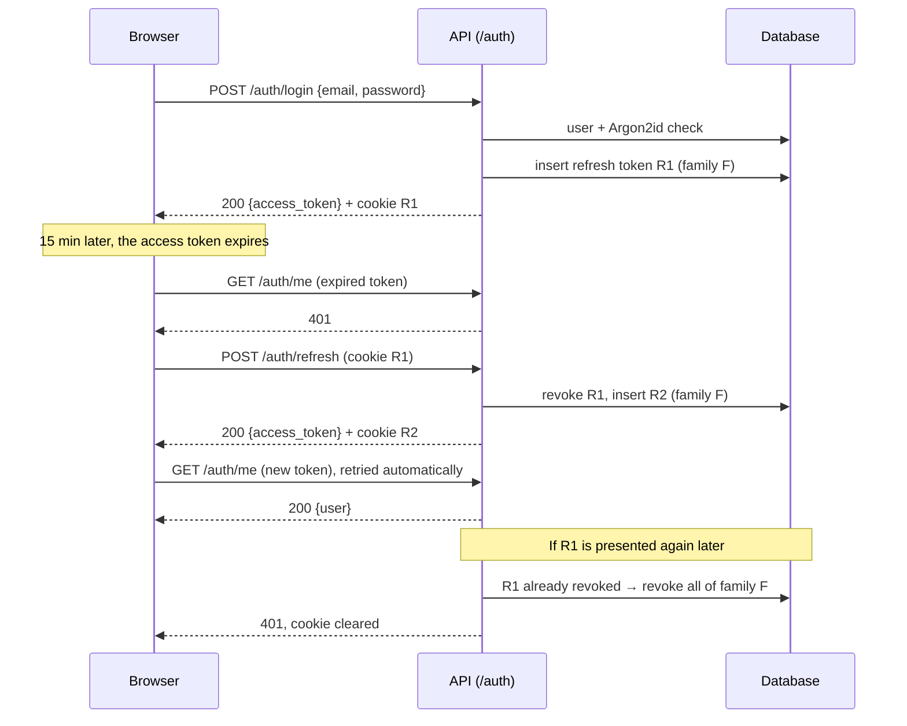
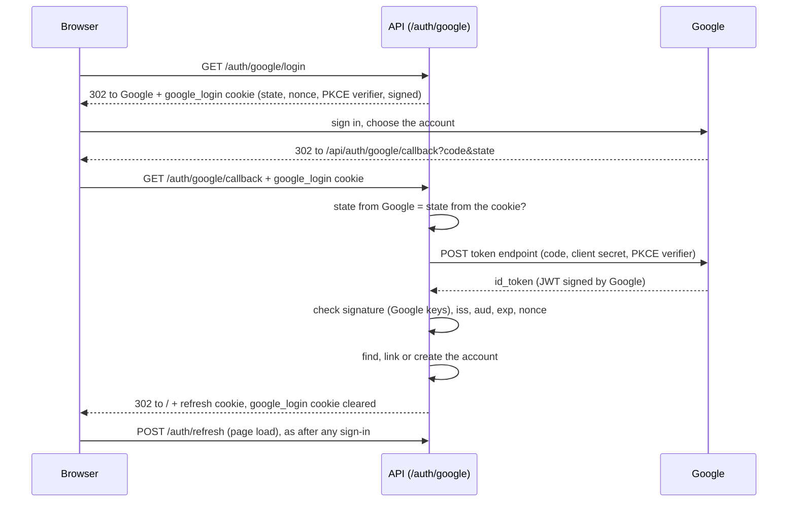

# Authentication

English | [Français](authentication.fr.md)

How users create an account and sign in to TierList: what the user sees, how it works technically, and where it lives in the code.

## 1. Functional overview

### What a user can do

| Action                    | Where                                                                                                                               | Result                                                                                                                                             |
| ------------------------- | ----------------------------------------------------------------------------------------------------------------------------------- | -------------------------------------------------------------------------------------------------------------------------------------------------- |
| Create an account         | `/register`: display name, email, password                                                                                          | The account is created and the user is signed in immediately. An email with a confirmation link is sent.                                           |
| Confirm the email address | link received by email (`/verify-email?token=…`), then "Confirmer mon adresse"                                                      | The address is confirmed. Until then, a banner on the home page offers to send the email again.                                                    |
| Sign in                   | `/login`: email, password                                                                                                           | The user is signed in and sent back to the page they wanted to open (home page by default).                                                        |
| Sign in with Google       | "Continuer avec Google" link on `/login` or `/register`                                                                             | The first time, the account is created (or linked to the existing account with the same email, see the linking rules); then the user is signed in. |
| Stay signed in            | automatic                                                                                                                           | Reloading the page or coming back later (up to 30 days of inactivity) does not ask for the password again.                                         |
| Sign out                  | "Se déconnecter" button on the home page                                                                                            | The session is closed on the server: it cannot be reused, even by someone who copied it.                                                           |
| Delete the account        | "Supprimer mon compte" button on the home page, then the password (or, for an account created with Google, a recent Google sign-in) | The account and all its sessions are erased permanently; the user is sent to `/login`.                                                             |

Every other page requires a session: without one, the user is redirected to `/login`.

### Rules

- **Email**: must be a valid address; it is unique and **case-insensitive** (`Alice@Example.com` and `alice@example.com` are the same account). It is stored in lowercase.
- **Password**: at least `PASSWORD_MIN_LENGTH` characters (8 by default, a server setting), at most 128. There is no other composition rule: length matters more than character classes. A password that is too short gets a `422` whose message states the minimum, e.g. `Le mot de passe doit contenir au moins 8 caractères`, shown under the field.
- **Display name**: 1 to 50 characters, surrounding spaces removed.
- **Email confirmation**: not required to use the application (the user is signed in right after registering); the link is valid `EMAIL_VERIFICATION_TTL_HOURS` (24 h by default) and can be sent again at most once every `EMAIL_COOLDOWN_SECONDS` (60 s by default). Future sensitive actions will require a confirmed address.
- **Google**: an account created with Google has no password and signs in with Google only. Its display name comes from the Google profile. Google is used only when it reports the email as **verified**; an account created with Google has a confirmed address.

### Messages

The API returns an error **code** (see [the error format](../backend/README.md#12-error-format)); the frontend displays the message matching that code, in the interface language. The messages below are the French ones; the English ones are in `frontend/src/i18n/locales/en.ts`.

| Situation                                                                                                    | HTTP | API code                                 | Message shown                                                                                          |
| ------------------------------------------------------------------------------------------------------------ | ---- | ---------------------------------------- | ------------------------------------------------------------------------------------------------------ |
| Email already used                                                                                           | 409  | `email_already_registered`               | `Cet email est déjà utilisé`                                                                           |
| Wrong email **or** wrong password                                                                            | 401  | `invalid_credentials`                    | `Email ou mot de passe incorrect` (same message in both cases)                                         |
| Invalid field                                                                                                | 422  | field `code` (e.g. `password_too_short`) | Message next to the field (e.g. password too short)                                                    |
| Session expired or revoked                                                                                   | 401  | `session_expired`                        | The user is sent back to `/login`                                                                      |
| Wrong password when deleting the account                                                                     | 403  | `incorrect_password`                     | `Mot de passe incorrect` (the dialog stays open)                                                       |
| Google account: last sign-in older than `RECENT_AUTHENTICATION_MAX_AGE_MINUTES` (5 by default) when deleting | 403  | `reauthentication_required`              | `Reconnectez-vous avec Google pour confirmer la suppression`, with a "Se reconnecter avec Google" link |
| Google sign-in cancelled                                                                                     | —    | `?error=google_cancelled`                | `Connexion avec Google annulée.` on `/login`                                                           |
| Google email not verified                                                                                    | —    | `?error=google_email_not_verified`       | `Votre adresse Google n'est pas vérifiée : elle ne peut pas servir à vous connecter.`                  |
| Google not configured on the server                                                                          | —    | `?error=google_unavailable`              | `La connexion avec Google n'est pas disponible pour le moment.`                                        |
| Any other Google failure                                                                                     | —    | `?error=google_failed`                   | `La connexion avec Google a échoué, veuillez réessayer.`                                               |
| Invalid or expired confirmation link                                                                         | 400  | `invalid_token`                          | `Ce lien est invalide ou a expiré.`                                                                    |

### Not available yet

- "Forgot password".
- Limiting repeated sign-in attempts (rate limiting).
- Other identity providers than Google.

## 2. Technical design

### Two tokens

| Token             | Format                                   | Lifetime                                                | Stored by the browser              | Sent                                                      |
| ----------------- | ---------------------------------------- | ------------------------------------------------------- | ---------------------------------- | --------------------------------------------------------- |
| **Access token**  | JWT signed with HS256 (`JWT_SECRET_KEY`) | 15 min (`ACCESS_TOKEN_TTL_MINUTES`)                     | In JavaScript memory only          | `Authorization: Bearer <token>` header, on every API call |
| **Refresh token** | Random opaque string (256 bits)          | 30 days (`REFRESH_TOKEN_TTL_DAYS`), renewed on each use | `refresh_token` cookie, `HttpOnly` | Automatically by the browser, only to `/api/auth/*`       |

Why this split:

- The **access token** is checked without a database query (signature + expiry). Being short-lived, a stolen one is useful for 15 minutes at most. It is never written to `localStorage`, which any injected script could read.
- The **refresh token** cannot be read by JavaScript (`HttpOnly`) and is stored server-side **as a SHA-256 hash only**. Because it lives in the database, it can be **revoked**: sign-out and theft detection work immediately, which a JWT alone cannot do.

Access token claims: `sub` (user id), `type` (`access`), `iat`, `exp`, `auth_time` (time of the original sign-in, kept across refreshes, used later to require a recent sign-in for sensitive actions).

### Refresh token rotation and theft detection

Each sign-in starts a **family** of refresh tokens. Each refresh **revokes** the token used and issues a new one in the same family. If a token that was already replaced is presented again, someone else holds a copy: the whole family is revoked, which signs out both the thief and the user.



When the page loads, no access token is in memory: the frontend calls `POST /auth/refresh`, and the cookie, if still valid, restores the session.

### Settings

Every duration and rule that may change per environment is read from `backend/.env` (see the backend README): `ACCESS_TOKEN_TTL_MINUTES` (15), `REFRESH_TOKEN_TTL_DAYS` (30), `PASSWORD_MIN_LENGTH` (8), `RECENT_AUTHENTICATION_MAX_AGE_MINUTES` (5), `GOOGLE_LOGIN_ATTEMPT_TTL_MINUTES` (10), `GOOGLE_HTTP_TIMEOUT_SECONDS` (10), `EMAIL_VERIFICATION_TTL_HOURS` (24), `EMAIL_COOLDOWN_SECONDS` (60). Changing them only needs a restart of the backend. The frontend does not duplicate `PASSWORD_MIN_LENGTH`: it shows the message of the `422`.

### Endpoints

| Method and path                              | Auth                                                    | Success                                                                                      | Errors                                                                 |
| -------------------------------------------- | ------------------------------------------------------- | -------------------------------------------------------------------------------------------- | ---------------------------------------------------------------------- |
| `POST /auth/register`                        | — (`language` optional: language of the email)          | `201` `TokenResponse` + refresh cookie; confirmation email sent                              | `409`, `422`                                                           |
| `POST /auth/login`                           | —                                                       | `200` `TokenResponse` + refresh cookie                                                       | `401`, `422`                                                           |
| `POST /auth/refresh`                         | refresh cookie                                          | `200` `TokenResponse` + new refresh cookie                                                   | `401` (cookie cleared)                                                 |
| `POST /auth/logout`                          | refresh cookie (optional)                               | `204`, family revoked, cookie cleared                                                        | —                                                                      |
| `GET /auth/me`                               | Bearer                                                  | `200` `UserResponse`                                                                         | `401` (`WWW-Authenticate: Bearer`)                                     |
| `POST /auth/email/verification`              | Bearer + `{language}`                                   | `204`; email sent again, unless the address is confirmed or the previous email is too recent | `401`                                                                  |
| `POST /auth/email/verify`                    | — + `{token}`                                           | `204`, address confirmed (a second use changes nothing)                                      | `400` `invalid_token`, `422`                                           |
| `DELETE /auth/me`                            | Bearer + `{password}` body (empty for a Google account) | `204`, user, sessions and Google identity deleted, cookie cleared                            | `401`, `403` (wrong password, or Google sign-in too old), `422`        |
| `GET /auth/google/login?next=delete-account` | —                                                       | `302` to Google + `google_login` cookie (`next` optional)                                    | `302` to `/login?error=google_unavailable`; `422` for any other `next` |
| `GET /auth/google/callback`                  | `google_login` cookie                                   | `302` to `/` (or `/?confirm=delete-account`) + refresh cookie                                | `302` to `/login?error=<code>`                                         |

`TokenResponse` is `{access_token, token_type: "bearer", expires_in}` (seconds). `UserResponse` is `{id, email, display_name, has_password, email_verified, created_at}`; the password hash is never returned.

### Refresh cookie

`refresh_token=<token>; HttpOnly; Secure; SameSite=Strict; Path=/api/auth; Max-Age=2592000`

- `HttpOnly`: invisible to JavaScript.
- `Secure`: HTTPS only. Disabled locally with `AUTH_COOKIE_SECURE=false`, since the development server uses HTTP.
- `SameSite=Strict`: never sent by a request coming from another site, which protects the cookie routes against CSRF.
- `Path=/api/auth`: sent only to the authentication routes, not to the rest of the API. It is the path **seen by the browser**: the Vite proxy forwards `/api/auth/...` to the backend's `/auth/...` (`AUTH_COOKIE_PATH`).

Frontend and backend are served from the same origin (Vite proxy in development), so no CORS configuration is needed.

### Email confirmation

- **Link**: `{FRONTEND_BASE_URL}/verify-email?token=<JWT>`, sent by email ([emails guide](emails.md)). The JWT (type `email_verification`, signed with `JWT_SECRET_KEY`) holds the user id and a **fingerprint** of the address (truncated SHA-256), never the address itself: a JWT can be read without the key, and a URL can end up in logs. It is not stored: if the account's address changes, the fingerprint no longer matches and the link is refused.
- **Confirmation on click**: the page waits for a click on "Confirmer mon adresse" before calling the API, so that a tool that opens the links of emails to analyse them (antispam) does not confirm the address in place of the user.
- **Sending again**: `POST /auth/email/verification` sends nothing if the address is already confirmed, or if the previous email is less than `EMAIL_COOLDOWN_SECONDS` old (`users.verification_email_sent_at`): this prevents flooding a mailbox. The answer is `204` in every case.
- **Existing accounts** (migration `fe4d7859b473`): those linked to Google are confirmed, the others are not and can ask for the email again.

### Account deletion

Deletion is **permanent** (no soft delete): the `users` row is deleted, and the database removes its refresh tokens through `ON DELETE CASCADE`, so every session of the account ends at once. The access tokens already issued are refused too, since `get_current_user` no longer finds the user.

The current password is required: a stolen access token alone is not enough to delete an account. A wrong password returns `403`, not `401`: the user is authenticated, and a `401` would make the frontend try to refresh the session for nothing.

An account created with Google has no password to ask for. Its confirmation is a **recent sign-in**: the `auth_time` claim of the access token (time of the original sign-in, kept across refreshes) must be more recent than `RECENT_AUTHENTICATION_MAX_AGE_MINUTES` (5 minutes by default). Otherwise the API answers `403`; the dialog then offers "Se reconnecter avec Google" (`/api/auth/google/login?next=delete-account`), and once back, the home page reopens the deletion dialog (`/?confirm=delete-account`). The Google identity is deleted with the account (`ON DELETE CASCADE`).

### Google sign-in (OpenID Connect)

TierList is an **OpenID Connect client** of Google: it does not issue tokens to other applications. Google only proves who the user is; the session is then the same as after a password sign-in (access token + refresh cookie).



- **`state`** must come back unchanged: it ties Google's answer to this browser (CSRF protection).
- **`nonce`** is copied by Google into the `id_token`: a token issued for another sign-in is refused.
- **PKCE** (`code_challenge` S256): an intercepted authorization code is useless without the verifier kept in the cookie.
- The **`google_login` cookie** holds these three values for `GOOGLE_LOGIN_ATTEMPT_TTL_MINUTES` (10 minutes by default), signed as a JWT with `JWT_SECRET_KEY` (the browser cannot change it). It is `HttpOnly`, limited to `/api/auth/google`, and `SameSite=Lax`, not `Strict`: the return from Google is a navigation coming from another site, for which the browser would not send a `Strict` cookie. It is cleared as soon as it has been used.
- The **`id_token`** is checked against Google's public keys (JWKS, cached), with algorithm RS256, issuer `accounts.google.com`, audience `GOOGLE_CLIENT_ID`, expiry and nonce. `iat` and `exp` allow 60 seconds of clock skew with Google (`GOOGLE_ID_TOKEN_CLOCK_SKEW_SECONDS`): without it, a token issued by a Google clock slightly ahead of ours would be refused as "not yet valid".

**Finding the account**, in this order:

1. the Google identity (claim `sub`, stable even if the email changes) is already linked: sign-in to that account;
2. otherwise, an account already uses this email: the Google identity is linked to it. If that account's address was **never confirmed**, its password is also **removed**, its sessions are closed and the address becomes confirmed (see below);
3. otherwise: a new account **without password** is created.

Cases 2 and 3 require `email_verified` from Google: otherwise anyone could take over an existing account, or reserve someone else's address.

**Why the password of an unconfirmed account is removed**: without it, someone could register with the Gmail address of another person, before her, and choose the password. When the real owner later signs in with Google, her Google identity would be linked to that account, whose password the other person knows: both would share the account (_pre-account takeover_). Google proves who owns the address, so the password set by someone else, and the sessions opened with it, are dropped. A real owner who had registered with a password can still sign in with Google. Identities are stored in the `oauth_accounts` table (`provider`, `provider_subject`, unique together).

**Setting up Google** (Google Cloud Console → APIs & Services → Credentials):

1. Configure the OAuth consent screen (application name, support email; scopes `openid`, `email`, `profile`).
2. Create an **OAuth client ID** of type **Web application**.
3. Add the **authorized redirect URI** exactly as `GOOGLE_REDIRECT_URI`: `http://localhost:5173/api/auth/google/callback` in development, the HTTPS URL in production.
4. Copy the client ID and secret into `backend/.env` (`GOOGLE_CLIENT_ID`, `GOOGLE_CLIENT_SECRET`), then restart the backend.

Without these two variables, the "Continuer avec Google" link leads back to `/login` with "La connexion avec Google n'est pas disponible pour le moment."

### Security choices

- **Passwords** are hashed with **Argon2id** (`pwdlib`, recommended parameters). The plain password is never stored or logged.
- **Same answer for unknown email and wrong password**: same message, and when the email is unknown a dummy hash is still verified, so that the response time does not reveal which emails have an account.
- **JWT algorithm pinned** to HS256 on decoding: a token signed with another algorithm, or unsigned (`alg: none`), is rejected.
- **Logs** contain the user id, never the password, the tokens or the email. A replayed refresh token is logged as a warning.
- Registration does reveal that an email is taken (`409`): the usual trade-off of a registration form.

### Known limitations

- **Several tabs restoring the session at the same moment** (e.g. reopening the browser with many tabs) can present the same refresh token twice. The second one is treated as a theft and the session is closed: the user signs in again. Within one tab, refreshes are shared so this cannot happen.
- An access token stays valid until it expires (15 min) even after sign-out; only its renewal is blocked.

## 3. In the code

### Backend (`backend/app/`)

| Layer         | File                                                                                                                                                                         | Content                                                                                                                                                                                                  |
| ------------- | ---------------------------------------------------------------------------------------------------------------------------------------------------------------------------- | -------------------------------------------------------------------------------------------------------------------------------------------------------------------------------------------------------- |
| Routes        | `api/routes/auth.py`                                                                                                                                                         | The ten `/auth` routes, including `/auth/google/login` and `/auth/google/callback`; set and clear the cookies; map domain errors to `AppHTTPException` (with an `ErrorCode`) or to redirections.         |
| Dependencies  | `api/dependencies.py`                                                                                                                                                        | `get_auth_service`, `get_current_session` (Bearer token → user + `auth_time`, otherwise 401), `get_current_user` (the user only) and `get_google_oauth_client` (`None` when Google is not configured).   |
| Schemas       | `schemas/auth.py`                                                                                                                                                            | `RegisterRequest`, `LoginRequest`, `TokenResponse`, `UserResponse`, `EmailVerificationRequest`, `VerifyEmailRequest`.                                                                                    |
| Service       | `services/auth.py`                                                                                                                                                           | `AuthService`: register, login, Google sign-in (find, link or create), refresh with rotation and theft detection, logout, account deletion. Owns the transactions (`commit`).                            |
| Google client | `services/google_oauth.py`                                                                                                                                                   | `GoogleLoginAttempt` (state, nonce, PKCE, signed cookie) and `GoogleOAuthClient` (authorization URL, code exchange with `httpx`, `id_token` check with the JWKS).                                        |
| Repositories  | `repositories/users.py`, `repositories/refresh_tokens.py`, `repositories/oauth_accounts.py`                                                                                  | Queries only. The refresh token is read `FOR UPDATE` so two simultaneous refreshes are processed one after the other.                                                                                    |
| Models        | `models/user.py`                                                                                                                                                             | `User` (`users` table, `password_hash` empty for a Google account), `RefreshToken` (`refresh_tokens`) and `OAuthAccount` (`oauth_accounts`), both `ON DELETE CASCADE` towards `users`.                   |
| Crypto        | `core/security.py`                                                                                                                                                           | Pure functions: Argon2id hashing, JWT creation and decoding, refresh token generation and hashing.                                                                                                       |
| Exceptions    | `exceptions/auth.py`, `exceptions/google.py`, `exceptions/http.py`                                                                                                           | Every domain exception (`InvalidCredentialsError`, `InvalidRefreshTokenError`, `GoogleAuthError`…), raised by services and mapped by routes; `AppHTTPException`, the HTTP error carrying the error code. |
| Constants     | `constants/auth.py`, `constants/google.py`, `constants/error_codes.py`, `constants/messages.py`                                                                              | Cookie names, token types, lengths, frontend paths, Google URLs, API error codes (`ErrorCode`), developer-facing API messages (English).                                                                 |
| Configuration | `core/config.py`                                                                                                                                                             | `JWT_SECRET_KEY`, `ACCESS_TOKEN_TTL_MINUTES`, `REFRESH_TOKEN_TTL_DAYS`, `AUTH_COOKIE_SECURE`, `AUTH_COOKIE_PATH`.                                                                                        |
| Migrations    | `migrations/versions/93f9cc04b237_create_users_and_refresh_tokens.py`, `95119a855a83_add_oauth_accounts_and_optional_.py`, `fe4d7859b473_add_email_verification_to_users.py` | Create the tables; the second one adds `oauth_accounts` and makes the password optional; the third one adds `email_verified_at` and `verification_email_sent_at`.                                        |

**Protecting a new endpoint**: add the `get_current_user` dependency. The route then receives the authenticated user, and the OpenAPI schema shows the Bearer requirement.

```python
from typing import Annotated

from fastapi import Depends

from app.api.dependencies import get_current_user
from app.models.user import User


@router.get("/tierlists")
def list_tierlists(user: Annotated[User, Depends(get_current_user)]) -> list[TierListResponse]:
    ...
```

### Frontend (`frontend/src/`)

| File                                            | Content                                                                                                                                                                                                                                                                                                                                                                                               |
| ----------------------------------------------- | ----------------------------------------------------------------------------------------------------------------------------------------------------------------------------------------------------------------------------------------------------------------------------------------------------------------------------------------------------------------------------------------------------- |
| `api/client.ts`                                 | In-memory access token (`setAccessToken`), middleware that adds `Authorization` and, on a `401`, refreshes **once** (shared between concurrent requests) then retries.                                                                                                                                                                                                                                |
| `errors/apiError.ts`, `errors/googleError.ts`   | `ApiError` (with the API `code` and `params`), `getFieldErrors` (422 errors per field) and the functions that translate an error code into a message.                                                                                                                                                                                                                                                 |
| `constants/`                                    | `auth.ts` (limits, Google path, session routes, query key), `routes.ts`, `http.ts`, `i18n.ts` (languages).                                                                                                                                                                                                                                                                                            |
| `i18n/locales/`                                 | Every text of the pages and every error message, in French (`fr.ts`) and English (`en.ts`): `auth.*`, `account.*`, `errors.api.*`, `errors.field.*`, `errors.google.*`.                                                                                                                                                                                                                               |
| `api/auth.ts`                                   | `register`, `login`, `logout`, `getMe`, `getCurrentUser` (restores the session at load) and the hooks `useCurrentUser`, `useRegister`, `useLogin`, `useLogout`.                                                                                                                                                                                                                                       |
| `auth/RequireAuth.tsx`                          | Route guard: loading, error, redirect to `/login` (remembering the requested page), or the private page.                                                                                                                                                                                                                                                                                              |
| `pages/LoginPage.tsx`, `pages/RegisterPage.tsx` | Forms with labelled fields, field errors, backend message, button disabled while sending, "Continuer avec Google" link (`components/GoogleSignInLink.tsx`); the login page explains the `?error=` codes of the Google return.                                                                                                                                                                         |
| `components/TextField.tsx`                      | Labelled input whose error is linked with `aria-describedby`.                                                                                                                                                                                                                                                                                                                                         |
| `components/DeleteAccountDialog.tsx`            | "Supprimer mon compte" button and native `<dialog>` (opened with `showModal()`: the browser traps the focus and closes it with Escape). It asks for the password, or for a Google account offers to sign in again when the API answers `403`. Opened at once when the home page has `?confirm=delete-account`. On success, the session and the query cache are cleared and the user goes to `/login`. |
| `pages/VerifyEmailPage.tsx`                     | Page of the link received by email: reads `token`, confirms the address on click (`useVerifyEmail`), explains an invalid or incomplete link.                                                                                                                                                                                                                                                          |
| `components/EmailVerificationBanner.tsx`        | Home page banner while the address is not confirmed, with "Renvoyer l'email" (`useRequestEmailVerification`).                                                                                                                                                                                                                                                                                         |
| `App.tsx`                                       | Routes (`react-router`): `/login`, `/register`, private `/`, unknown paths redirected to `/`.                                                                                                                                                                                                                                                                                                         |

The current user is **server state**, kept in the TanStack Query cache under `['auth', 'me']`: no separate React context. Sign-in and registration refresh this entry; sign-out clears the whole cache.

Hiding pages in the frontend is only for comfort: the real protection is the backend checking the access token on every protected route.

### Tests

Described in the [testing guide](testing.md): `tests/test_security.py`, `tests/test_google_oauth.py`, `tests/integration/test_auth.py`, `tests/integration/test_google_auth.py` (backend), `src/api/client.test.ts`, `src/api/auth.test.ts`, `src/App.test.tsx`, `src/pages/*.test.tsx` and `src/components/DeleteAccountDialog.test.tsx` (frontend).
