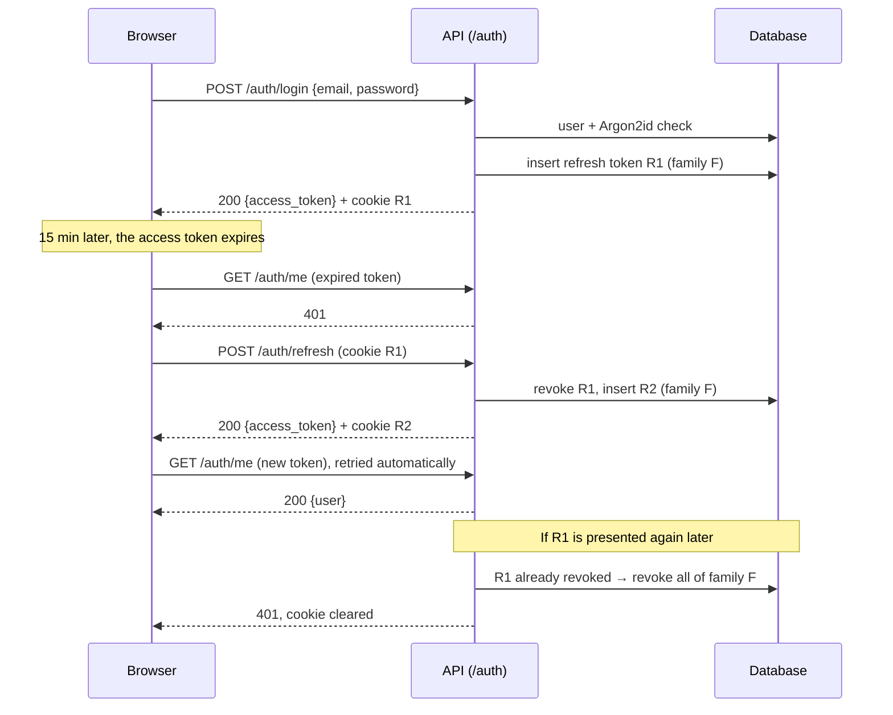

# Authentication

English | [Français](authentication.fr.md)

How users create an account and sign in to TierList: what the user sees, how it works technically, and where it lives in the code.

## 1. Functional overview

### What a user can do

| Action            | Where                                      | Result                                                                                                     |
| ----------------- | ------------------------------------------ | ---------------------------------------------------------------------------------------------------------- |
| Create an account | `/register`: display name, email, password | The account is created and the user is signed in immediately.                                              |
| Sign in           | `/login`: email, password                  | The user is signed in and sent back to the page they wanted to open (home page by default).                |
| Stay signed in    | automatic                                  | Reloading the page or coming back later (up to 30 days of inactivity) does not ask for the password again. |
| Sign out          | "Se déconnecter" button on the home page   | The session is closed on the server: it cannot be reused, even by someone who copied it.                   |

Every other page requires a session: without one, the user is redirected to `/login`.

### Rules

- **Email**: must be a valid address; it is unique and **case-insensitive** (`Alice@Example.com` and `alice@example.com` are the same account). It is stored in lowercase.
- **Password**: 8 to 128 characters. There is no other composition rule: length matters more than character classes.
- **Display name**: 1 to 50 characters, surrounding spaces removed.

### Messages

| Situation                         | HTTP | Message shown                                                  |
| --------------------------------- | ---- | -------------------------------------------------------------- |
| Email already used                | 409  | `Cet email est déjà utilisé`                                   |
| Wrong email **or** wrong password | 401  | `Email ou mot de passe incorrect` (same message in both cases) |
| Invalid field                     | 422  | Message next to the field (e.g. password too short)            |
| Session expired or revoked        | 401  | The user is sent back to `/login`                              |

### Not available yet

- Email address verification and "forgot password" (they need an email service).
- Limiting repeated sign-in attempts (rate limiting).
- Account deletion and Google sign-in: planned in the next pull requests.

## 2. Technical design

### Two tokens

| Token             | Format                                   | Lifetime                                                | Stored by the browser              | Sent                                                      |
| ----------------- | ---------------------------------------- | ------------------------------------------------------- | ---------------------------------- | --------------------------------------------------------- |
| **Access token**  | JWT signed with HS256 (`JWT_SECRET_KEY`) | 15 min (`ACCESS_TOKEN_TTL_MINUTES`)                     | In JavaScript memory only          | `Authorization: Bearer <token>` header, on every API call |
| **Refresh token** | Random opaque string (256 bits)          | 30 days (`REFRESH_TOKEN_TTL_DAYS`), renewed on each use | `refresh_token` cookie, `HttpOnly` | Automatically by the browser, only to `/api/auth/*`       |

Why this split:

- The **access token** is checked without a database query (signature + expiry). Being short-lived, a stolen one is useful for 15 minutes at most. It is never written to `localStorage`, which any injected script could read.
- The **refresh token** cannot be read by JavaScript (`HttpOnly`) and is stored server-side **as a SHA-256 hash only**. Because it lives in the database, it can be **revoked**: sign-out and theft detection work immediately, which a JWT alone cannot do.

Access token claims: `sub` (user id), `type` (`access`), `iat`, `exp`, `auth_time` (time of the original sign-in, kept across refreshes, used later to require a recent sign-in for sensitive actions).

### Refresh token rotation and theft detection

Each sign-in starts a **family** of refresh tokens. Each refresh **revokes** the token used and issues a new one in the same family. If a token that was already replaced is presented again, someone else holds a copy: the whole family is revoked, which signs out both the thief and the user.



When the page loads, no access token is in memory: the frontend calls `POST /auth/refresh`, and the cookie, if still valid, restores the session.

### Endpoints

| Method and path       | Auth                      | Success                                    | Errors                             |
| --------------------- | ------------------------- | ------------------------------------------ | ---------------------------------- |
| `POST /auth/register` | —                         | `201` `TokenResponse` + refresh cookie     | `409`, `422`                       |
| `POST /auth/login`    | —                         | `200` `TokenResponse` + refresh cookie     | `401`, `422`                       |
| `POST /auth/refresh`  | refresh cookie            | `200` `TokenResponse` + new refresh cookie | `401` (cookie cleared)             |
| `POST /auth/logout`   | refresh cookie (optional) | `204`, family revoked, cookie cleared      | —                                  |
| `GET /auth/me`        | Bearer                    | `200` `UserResponse`                       | `401` (`WWW-Authenticate: Bearer`) |

`TokenResponse` is `{access_token, token_type: "bearer", expires_in}` (seconds). `UserResponse` is `{id, email, display_name, created_at}`; the password hash is never returned.

### Refresh cookie

`refresh_token=<token>; HttpOnly; Secure; SameSite=Strict; Path=/api/auth; Max-Age=2592000`

- `HttpOnly`: invisible to JavaScript.
- `Secure`: HTTPS only. Disabled locally with `AUTH_COOKIE_SECURE=false`, since the development server uses HTTP.
- `SameSite=Strict`: never sent by a request coming from another site, which protects the cookie routes against CSRF.
- `Path=/api/auth`: sent only to the authentication routes, not to the rest of the API. It is the path **seen by the browser**: the Vite proxy forwards `/api/auth/...` to the backend's `/auth/...` (`AUTH_COOKIE_PATH`).

Frontend and backend are served from the same origin (Vite proxy in development), so no CORS configuration is needed.

### Security choices

- **Passwords** are hashed with **Argon2id** (`pwdlib`, recommended parameters). The plain password is never stored or logged.
- **Same answer for unknown email and wrong password**: same message, and when the email is unknown a dummy hash is still verified, so that the response time does not reveal which emails have an account.
- **JWT algorithm pinned** to HS256 on decoding: a token signed with another algorithm, or unsigned (`alg: none`), is rejected.
- **Logs** contain the user id, never the password, the tokens or the email. A replayed refresh token is logged as a warning.
- Registration does reveal that an email is taken (`409`): without email verification, this is the usual trade-off.

### Known limitations

- **Several tabs restoring the session at the same moment** (e.g. reopening the browser with many tabs) can present the same refresh token twice. The second one is treated as a theft and the session is closed: the user signs in again. Within one tab, refreshes are shared so this cannot happen.
- An access token stays valid until it expires (15 min) even after sign-out; only its renewal is blocked.

## 3. In the code

### Backend (`backend/app/`)

| Layer         | File                                                                  | Content                                                                                                               |
| ------------- | --------------------------------------------------------------------- | --------------------------------------------------------------------------------------------------------------------- |
| Routes        | `api/routes/auth.py`                                                  | The five `/auth` routes; set and clear the refresh cookie; map domain errors to `HTTPException`.                      |
| Dependencies  | `api/dependencies.py`                                                 | `get_auth_service` and `get_current_user` (Bearer token → `User`, otherwise 401).                                     |
| Schemas       | `schemas/auth.py`                                                     | `RegisterRequest`, `LoginRequest`, `TokenResponse`, `UserResponse`.                                                   |
| Service       | `services/auth.py`                                                    | `AuthService`: register, login, refresh with rotation and theft detection, logout. Owns the transactions (`commit`).  |
| Repositories  | `repositories/users.py`, `repositories/refresh_tokens.py`             | Queries only. The refresh token is read `FOR UPDATE` so two simultaneous refreshes are processed one after the other. |
| Models        | `models/user.py`                                                      | `User` (`users` table), `RefreshToken` (`refresh_tokens` table, `ON DELETE CASCADE` towards `users`).                 |
| Crypto        | `core/security.py`                                                    | Pure functions: Argon2id hashing, JWT creation and decoding, refresh token generation and hashing.                    |
| Configuration | `core/config.py`                                                      | `JWT_SECRET_KEY`, `ACCESS_TOKEN_TTL_MINUTES`, `REFRESH_TOKEN_TTL_DAYS`, `AUTH_COOKIE_SECURE`, `AUTH_COOKIE_PATH`.     |
| Migration     | `migrations/versions/93f9cc04b237_create_users_and_refresh_tokens.py` | Creates both tables.                                                                                                  |

**Protecting a new endpoint**: add the `get_current_user` dependency. The route then receives the authenticated user, and the OpenAPI schema shows the Bearer requirement.

```python
from typing import Annotated

from fastapi import Depends

from app.api.dependencies import get_current_user
from app.models.user import User


@router.get("/tierlists")
def list_tierlists(user: Annotated[User, Depends(get_current_user)]) -> list[TierListResponse]:
    ...
```

### Frontend (`frontend/src/`)

| File                                            | Content                                                                                                                                                                                                   |
| ----------------------------------------------- | --------------------------------------------------------------------------------------------------------------------------------------------------------------------------------------------------------- |
| `api/client.ts`                                 | In-memory access token (`setAccessToken`), middleware that adds `Authorization` and, on a `401`, refreshes **once** (shared between concurrent requests) then retries; `getFieldErrors` for 422 messages. |
| `api/auth.ts`                                   | `register`, `login`, `logout`, `getMe`, `getCurrentUser` (restores the session at load) and the hooks `useCurrentUser`, `useRegister`, `useLogin`, `useLogout`.                                           |
| `auth/RequireAuth.tsx`                          | Route guard: loading, error, redirect to `/login` (remembering the requested page), or the private page.                                                                                                  |
| `pages/LoginPage.tsx`, `pages/RegisterPage.tsx` | Forms with labelled fields, field errors, backend message, button disabled while sending.                                                                                                                 |
| `components/TextField.tsx`                      | Labelled input whose error is linked with `aria-describedby`.                                                                                                                                             |
| `App.tsx`                                       | Routes (`react-router`): `/login`, `/register`, private `/`, unknown paths redirected to `/`.                                                                                                             |

The current user is **server state**, kept in the TanStack Query cache under `['auth', 'me']`: no separate React context. Sign-in and registration refresh this entry; sign-out clears the whole cache.

Hiding pages in the frontend is only for comfort: the real protection is the backend checking the access token on every protected route.

### Tests

Described in the [testing guide](testing.md): `tests/test_security.py`, `tests/integration/test_auth.py` (backend), `src/api/client.test.ts`, `src/api/auth.test.ts`, `src/App.test.tsx` and `src/pages/*.test.tsx` (frontend).
