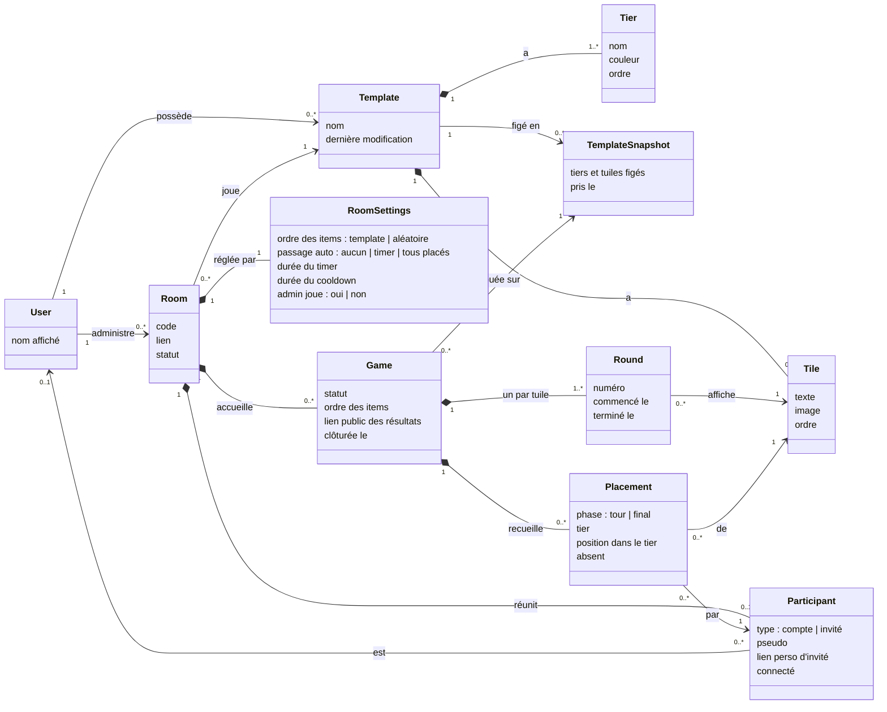

# Jalon 1 — Modèle de domaine

[English](domain-model.md) | Français

Les concepts métier du [jalon 1](README.fr.md), leurs relations et les règles qu'ils respectent toujours. C'est un modèle **conceptuel** : il nomme ce que le produit manipule, pas comment c'est stocké. Les types des attributs sont des types métier (texte, durée, lien…), pas des types de base de données.

Les noms de concepts du diagramme restent en anglais, comme ils le seront dans le code ; le tableau [Concepts](#concepts) donne leur équivalent français.

## Diagramme de classes

## Concepts

| Concept                                | Sens                                                                                                                                                                                         |
| -------------------------------------- | -------------------------------------------------------------------------------------------------------------------------------------------------------------------------------------------- |
| **User** (utilisateur)                 | Un compte. Existe déjà ([authentification](../../technical/authentication.fr.md)) ; seul son nom affiché compte ici.                                                                         |
| **Template**                           | Ce qu'on classe : ses tiers et ses tuiles. Privé à son propriétaire dans ce jalon.                                                                                                           |
| **Tier**                               | Une ligne de la tier list, avec un nom, une couleur et sa place dans la liste. Par défaut : S, A, B, C, D, E.                                                                                |
| **Tile** (tuile)                       | Un item à classer : un texte, une image (stockée compressée), ou les deux. Son ordre est l'ordre du template.                                                                                |
| **TemplateSnapshot** (version figée)   | La copie figée des tiers et des tuiles d'un template, prise au lancement d'une partie. Modifier ou supprimer le template ne la change jamais.                                                |
| **Room**                               | L'endroit où un groupe joue, rejoint par son lien ou son code. Persiste entre les parties jusqu'à sa fermeture.                                                                              |
| **RoomSettings** (réglages de la room) | Les quatre réglages du jalon. S'appliquent à la prochaine partie.                                                                                                                            |
| **Participant**                        | Une place dans une room : un utilisateur (joueur) ou un invité avec un pseudo et un lien perso. Garde sa place malgré les déconnexions.                                                      |
| **Game** (partie)                      | Une partie d'une version figée dans une room : l'ordre des items, les tours, les placements et, une fois clôturée, les résultats et leur lien public.                                        |
| **Round** (tour)                       | Le moment où une tuile est affichée et placée par tous. Une partie a un tour par tuile de sa version figée.                                                                                  |
| **Placement**                          | Où un participant a mis une tuile : un tier et une position dans ce tier, pour une phase (**tour** = « à chaud », **final** = après le cooldown). Un placement du tour peut être **absent**. |

Les **résultats** (par participant, répartition globale, classement médian) ne sont pas un concept à part : ils sont **calculés à partir des placements finaux** d'une partie clôturée.

## Invariants

Règles que le modèle respecte toujours, quel que soit l'écran ou l'action :

1. Un template a **au moins un tier** et **au plus 32 tuiles**.
2. Une room a **au plus 10 participants**, admin de la room compris.
3. Une room a **au plus une partie en cours**.
4. Une partie est jouée sur **une version figée**, prise à son lancement, qui **ne change jamais** ensuite.
5. Une partie a exactement **un tour par tuile** de sa version figée, dans l'**ordre des items** fixé au lancement.
6. Un participant a **au plus un placement du tour** et **au plus un placement final** par tuile d'une partie.
7. Dans un tier, les positions des placements finaux d'un participant sont **ordonnées sans trou** : elles forment son classement.
8. Un placement du tour est soit un **tier et une position**, soit **absent** ; un placement absent n'a pas de tier.
9. Les placements ne changent que **pendant leur tour** (phase tour) ou **pendant le cooldown** (phase finale) ; une fois la partie clôturée, plus rien ne change.
10. Un participant invité n'est **jamais relié à un utilisateur** ; un joueur est relié à exactement un utilisateur, et un utilisateur a **au plus une place** par room.
11. Une room fermée n'accepte **ni nouveau participant ni nouvelle partie** ; les liens publics des résultats de ses parties continuent de marcher.
