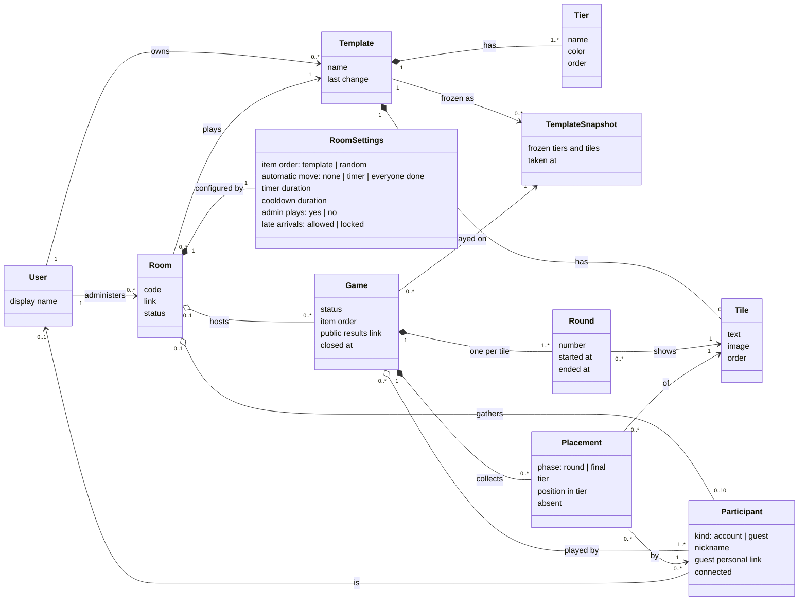

# Milestone 1 — Domain model

English | [Français](domain-model.fr.md)

The business concepts of [milestone 1](README.md), their relations and the rules they must always respect. This is a **conceptual** model: it names what the product manipulates, not how it is stored. Attribute types are business types (text, duration, link…), not database types.

## Class diagram

## Concepts

| Concept              | Meaning                                                                                                                                                                        |
| -------------------- | ------------------------------------------------------------------------------------------------------------------------------------------------------------------------------ |
| **User**             | An account. Already exists ([authentication](../../technical/authentication.md)); only its display name matters here.                                                          |
| **Template**         | What is ranked: its tiers and its tiles. Private to its owner in this milestone.                                                                                               |
| **Tier**             | A row of the tier list, with a name, a color and its place in the list. Default: S, A, B, C, D, E.                                                                             |
| **Tile**             | An item to rank: a text, an image (stored compressed), or both. Its order is the template order.                                                                               |
| **TemplateSnapshot** | The frozen copy of a template's tiers and tiles, taken when a game starts. Editing or deleting the template never changes it.                                                  |
| **Room**             | The place where a group plays, reached by its link or code. Persists between games until closed; then it is **not kept**, only its games are.                                  |
| **RoomSettings**     | The five settings of the milestone. Apply to the next game.                                                                                                                    |
| **Participant**      | A seat in a room: a user (player) or a guest with a nickname and a personal link. Keeps their seat across disconnections.                                                      |
| **Game**             | One play of a template snapshot in a room: the item order, the rounds, the placements and, once closed, the results and their public link.                                     |
| **Round**            | The moment one tile is shown and placed by everyone. A game has one round per tile of its snapshot.                                                                            |
| **Placement**        | Where a participant put a tile: a tier and a position in that tier, for a phase (**round** = "hot take", **final** = after the cooldown). A round placement can be **absent**. |

**Results** (per participant, overall distribution, median ranking) are not a concept of their own: they are **computed from the final placements** of a closed game.

## Invariants

Rules the model always respects, whatever the screen or the action:

1. A template has **at least one tier** and **at most 32 tiles**.
2. A room has **at most 10 participants**, room admin included.
3. A room has **at most one game in progress**.
4. A game is played on **one snapshot**, taken when it starts, and **never changes** afterwards.
5. A game has exactly **one round per tile** of its snapshot, in the **item order** fixed when the game starts.
6. A participant has **at most one round placement** and **at most one final placement** per tile of a game.
7. Within a tier, the positions of a participant's final placements are **ordered without gaps**: they form the participant's ranking.
8. A round placement is either a **tier and position** or **absent**; an absent round placement has no tier.
9. Placements can change only **during their round** (round phase) or **during the cooldown** (final phase); once the game is closed, nothing changes.
10. A guest participant is **never linked to a user**; a player is linked to exactly one user, and a user has **at most one seat** per room.
11. Closing a room **removes it**, with its link, its code and the seats that took part in no game. Its **games are kept**, with their participants, placements, results and public links: a game **outlives** its room.
