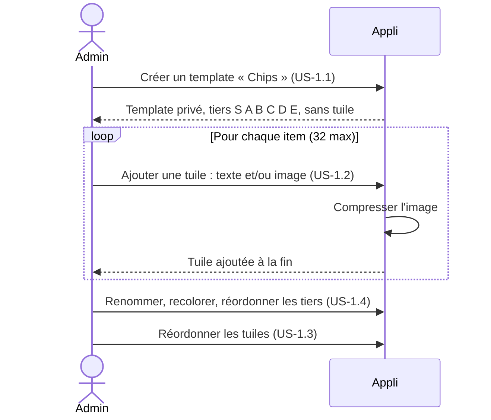
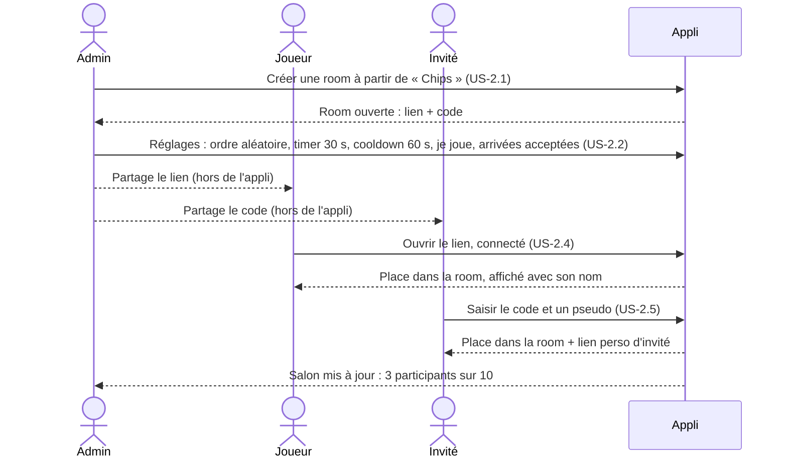
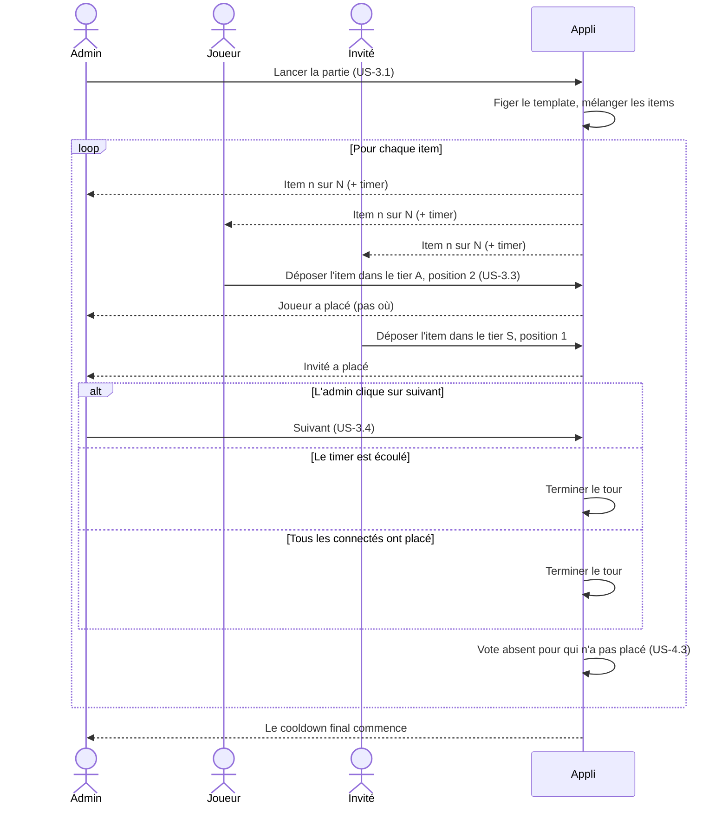
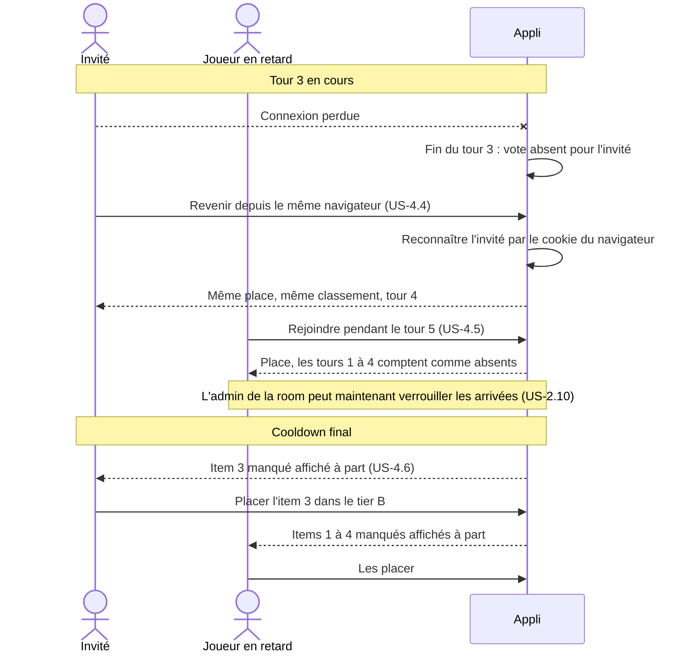
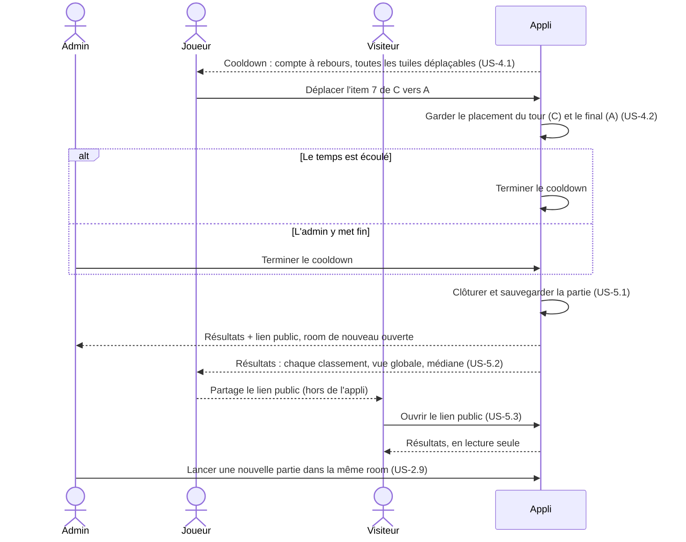

# Jalon 1 — Déroulé

[English](game-flow.md) | Français

Qui fait quoi, et dans quel ordre, dans le [jalon 1](README.fr.md) : de la création d'un template au partage des résultats. Les diagrammes montrent des **échanges métier** entre les acteurs et l'application, pas des appels techniques. États : [lifecycles.fr.md](lifecycles.fr.md). Stories : [user-stories.fr.md](user-stories.fr.md).

Acteurs : **Admin** (admin de la room, ici aussi propriétaire du template), **Joueur** (participant avec un compte), **Invité** (participant sans compte), **Visiteur** (n'importe qui avec le lien public), **Appli** (TierList).

## 1. Préparer un template

## 2. Créer une room et réunir les joueurs

## 3. Jouer les tours

## 4. Déconnexion, arrivée en retard et rattrapage

## 5. Cooldown, clôture et résultats

