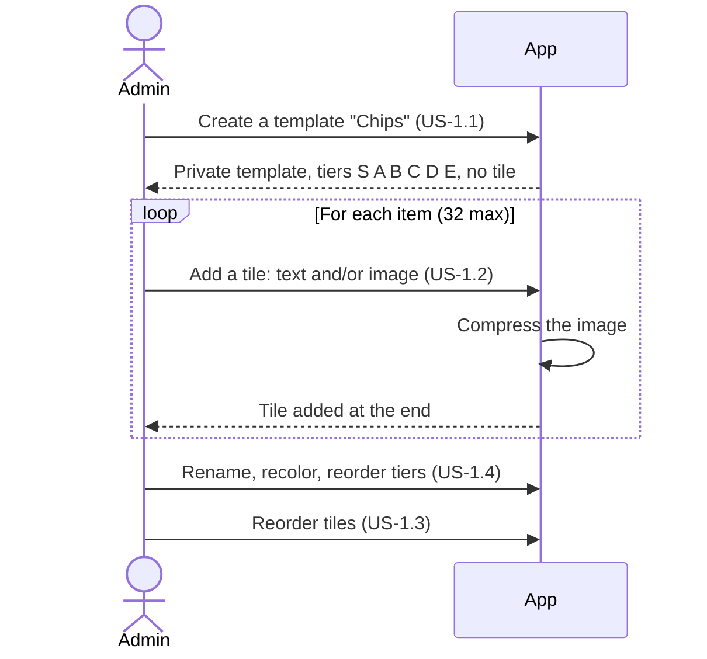
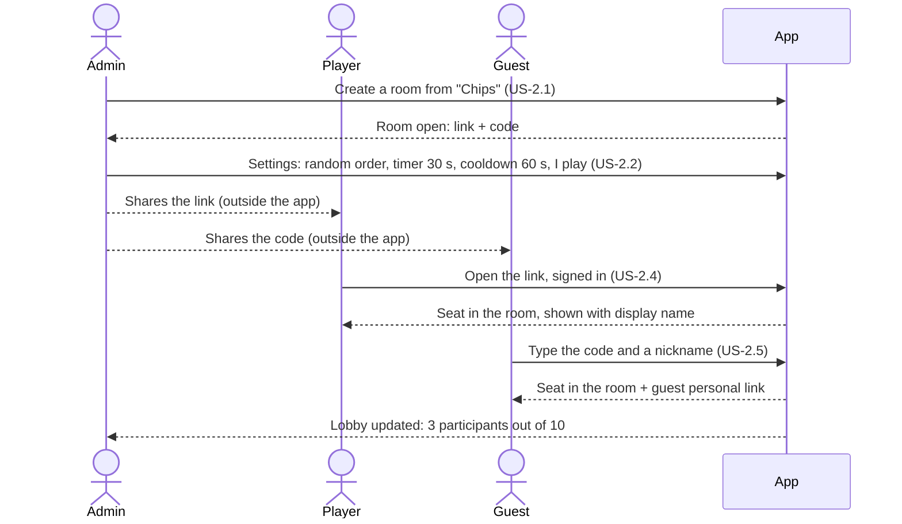
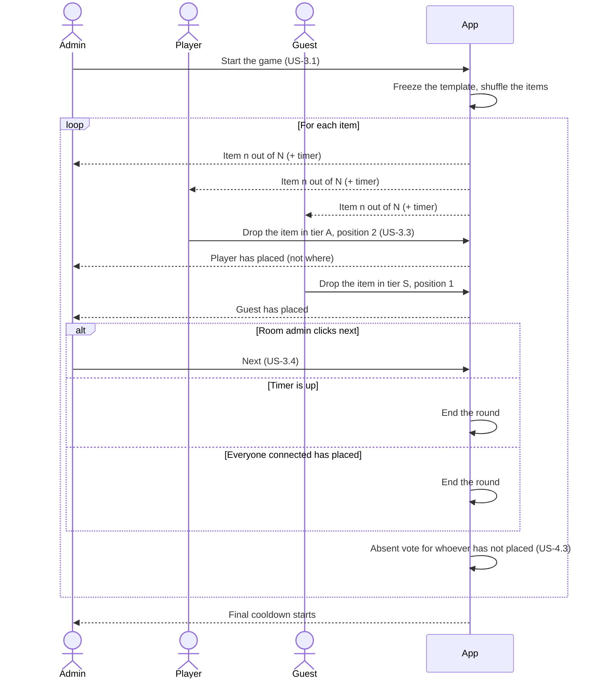
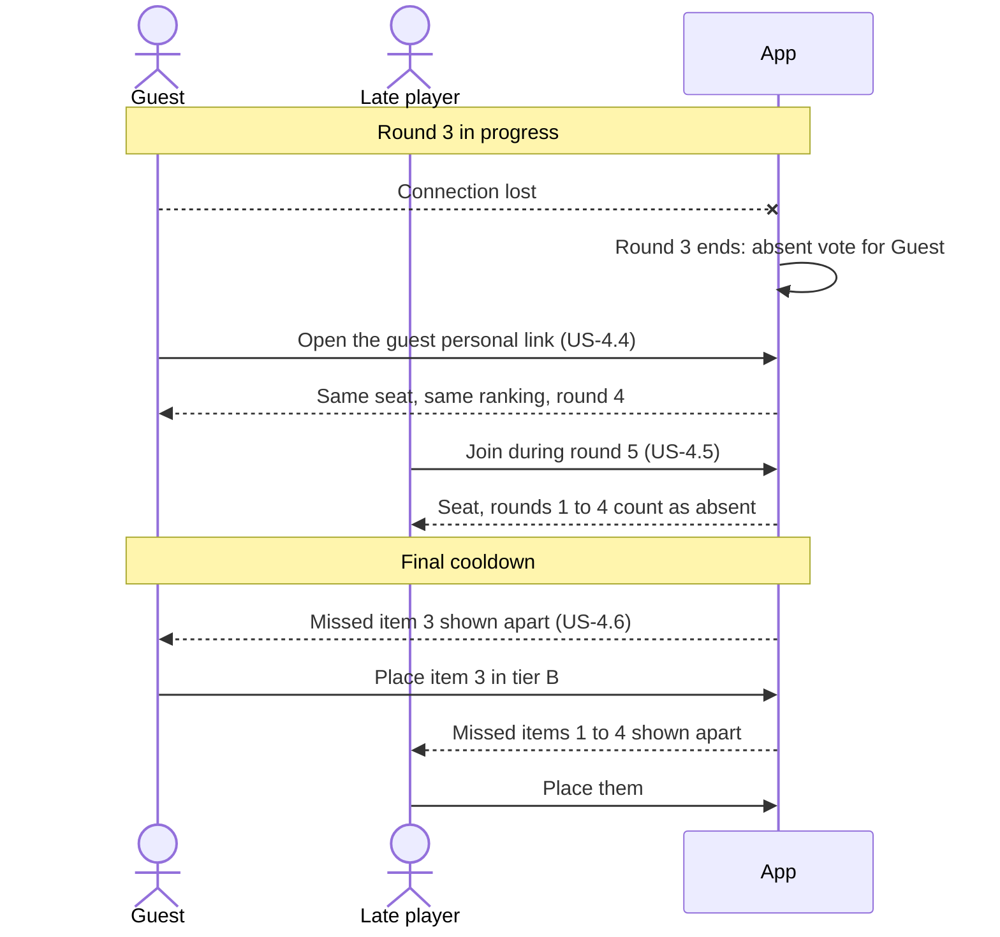
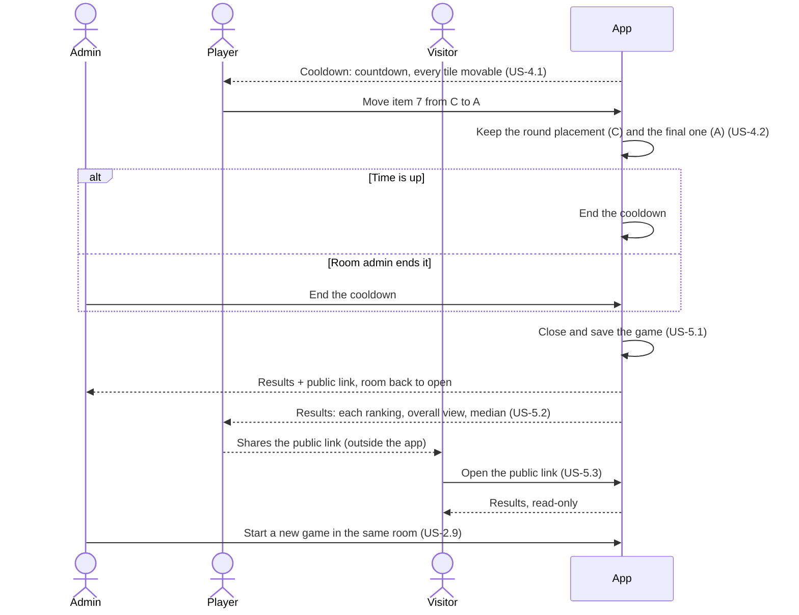

# Milestone 1 — Game flow

English | [Français](game-flow.fr.md)

Who does what, and in which order, in [milestone 1](README.md): from creating a template to sharing the results. The diagrams show **business exchanges** between the actors and the application, not technical calls. States: [lifecycles.md](lifecycles.md). Stories: [user-stories.md](user-stories.md).

Actors: **Admin** (room admin, here also the template owner), **Player** (participant with an account), **Guest** (participant without an account), **Visitor** (anyone with the public link), **App** (TierList).

## 1. Prepare a template

## 2. Create a room and gather the players

## 3. Play the rounds

## 4. Disconnection, late arrival and catching up

## 5. Cooldown, closing and results

