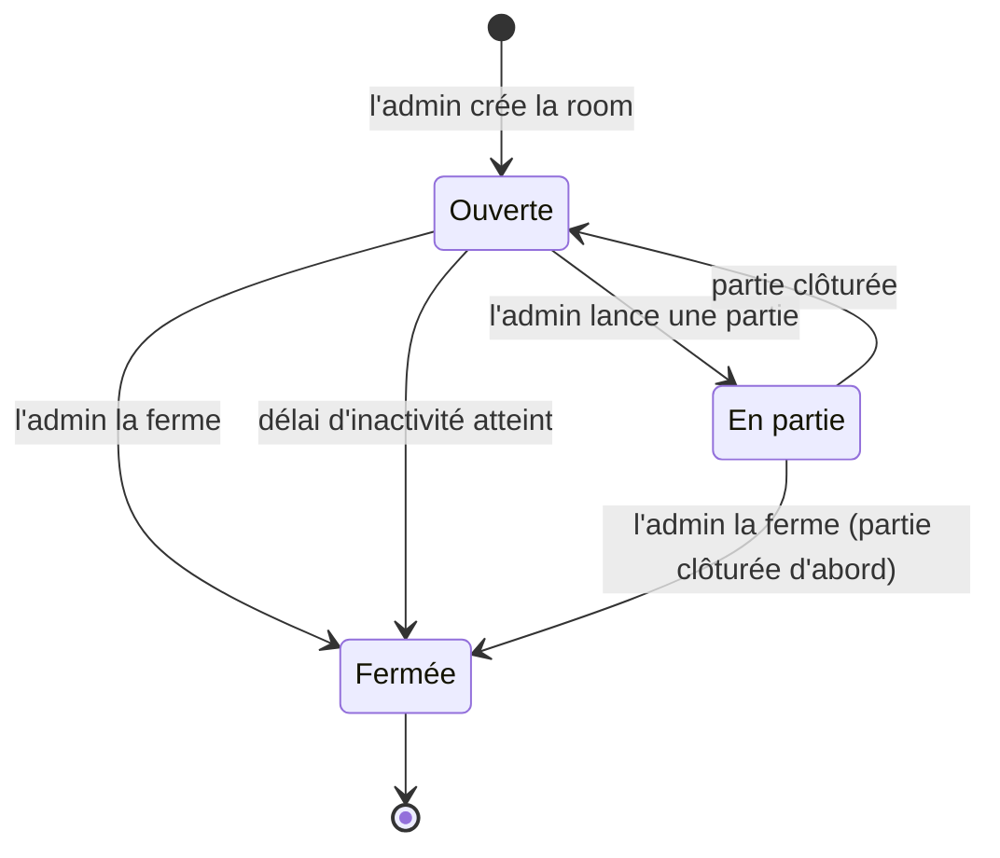
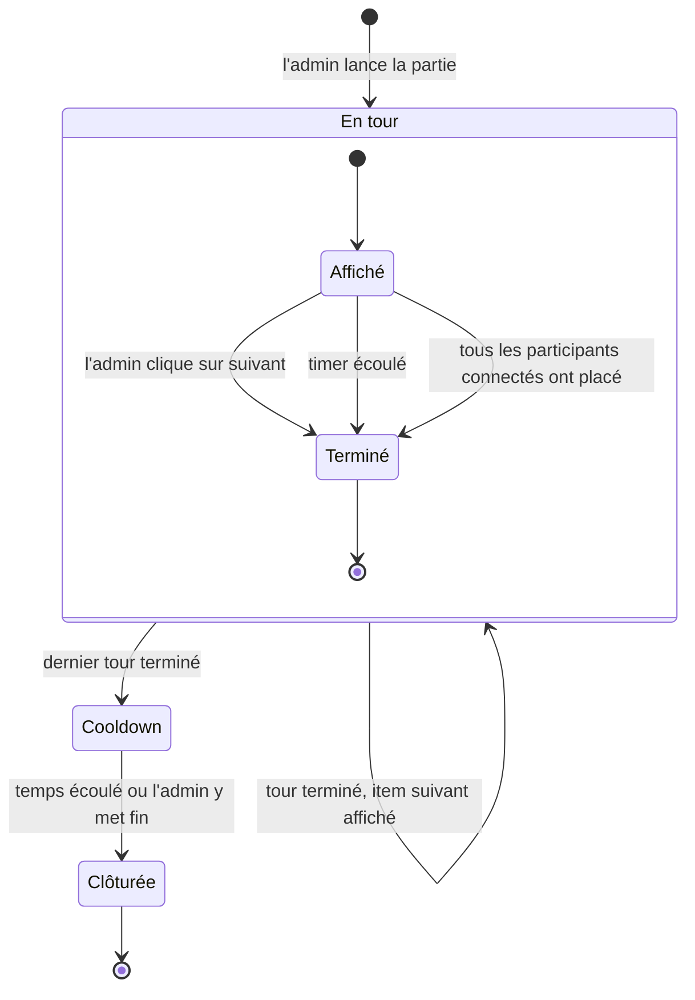
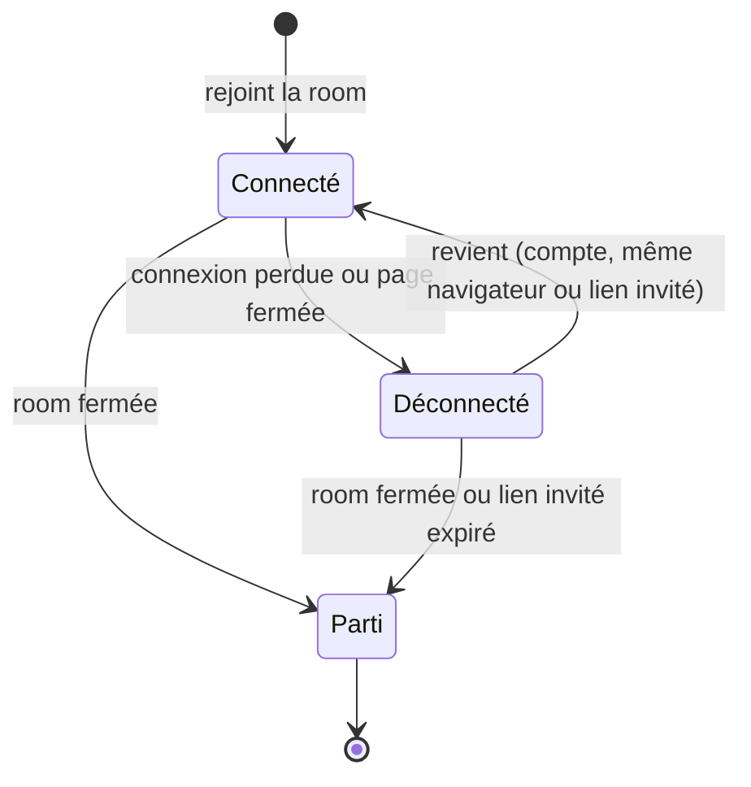

# Jalon 1 — Cycles de vie

[English](lifecycles.md) | Français

Les états des principaux concepts du [jalon 1](README.fr.md) et ce qui les fait passer de l'un à l'autre. Concepts : [domain-model.fr.md](domain-model.fr.md). Stories : [user-stories.fr.md](user-stories.fr.md).

## Room

| État          | Sens                                                                                                                                                                               | Qui peut rejoindre                           |
| ------------- | ---------------------------------------------------------------------------------------------------------------------------------------------------------------------------------- | -------------------------------------------- |
| **Ouverte**   | Le salon : les participants se rassemblent, l'admin de la room change les réglages, on peut revoir les résultats passés.                                                           | N'importe qui avec le lien ou le code (≤ 10) |
| **En partie** | Une partie est en cours. Les réglages sont verrouillés, sauf les arrivées.                                                                                                         | Si les arrivées sont acceptées (≤ 10)        |
| **Fermée**    | Définitif : la room **n'est pas gardée** (lien et code supprimés, liens perso des invités morts). Seules ses **parties** sont gardées : historique et liens publics des résultats. | Personne                                     |

| Transition          | Déclenchée par                                                                        | Story          |
| ------------------- | ------------------------------------------------------------------------------------- | -------------- |
| Ouverte → En partie | L'admin de la room lance une partie.                                                  | US-3.1         |
| En partie → Ouverte | La partie est clôturée (fin du cooldown).                                             | US-5.1         |
| Ouverte → Fermée    | L'admin de la room ferme la room, ou le délai d'inactivité est atteint.               | US-2.7, US-2.8 |
| En partie → Fermée  | L'admin de la room ferme la room après confirmation ; la partie est clôturée d'abord. | US-2.7         |

## Partie

| État         | Sens                                                                                                                                                  |
| ------------ | ----------------------------------------------------------------------------------------------------------------------------------------------------- |
| **En tour**  | Un item est affiché ; les participants le placent. Les items passés ne se déplacent pas.                                                              |
| **Cooldown** | Phase chronométrée : les participants déplacent n'importe quelle tuile et placent les items manqués.                                                  |
| **Clôturée** | Les classements sont définitifs ; les résultats et le lien public sont disponibles ; la partie est dans l'historique des participants avec un compte. |

Une partie commence directement par son premier tour : le « salon » est l'état **Ouverte** de la room.

### Tour

Un tour est **Affiché** pendant que les participants placent l'item, puis **Terminé** :

| Le tour se termine quand                             | Condition                                           |
| ---------------------------------------------------- | --------------------------------------------------- |
| L'admin de la room clique sur « suivant »            | Toujours possible.                                  |
| Le timer est écoulé                                  | Seulement avec le réglage « timer ».                |
| Tous les participants **connectés** ont placé l'item | Seulement avec le réglage « tout le monde a fini ». |

À la fin d'un tour, chaque participant sans placement du tour pour l'item reçoit un placement **absent** (US-4.3). Après le dernier tour, la partie passe en **Cooldown**.

## Participant

| État           | Sens                                                                                                                                                           |
| -------------- | -------------------------------------------------------------------------------------------------------------------------------------------------------------- |
| **Connecté**   | Présent dans la room ; participe au tour en cours.                                                                                                             |
| **Déconnecté** | Garde sa place et son classement ; reçoit des placements absents pour les tours qui se terminent entre-temps ; n'est pas attendu par « tout le monde a fini ». |
| **Parti**      | La place n'existe plus (room fermée, ou lien invité expiré). Les parties déjà clôturées restent dans l'historique des comptes.                                 |

Un participant qui rejoint **pendant** une partie commence **Connecté** au tour en cours ; les tours passés sont des placements absents pour lui (US-4.5).
