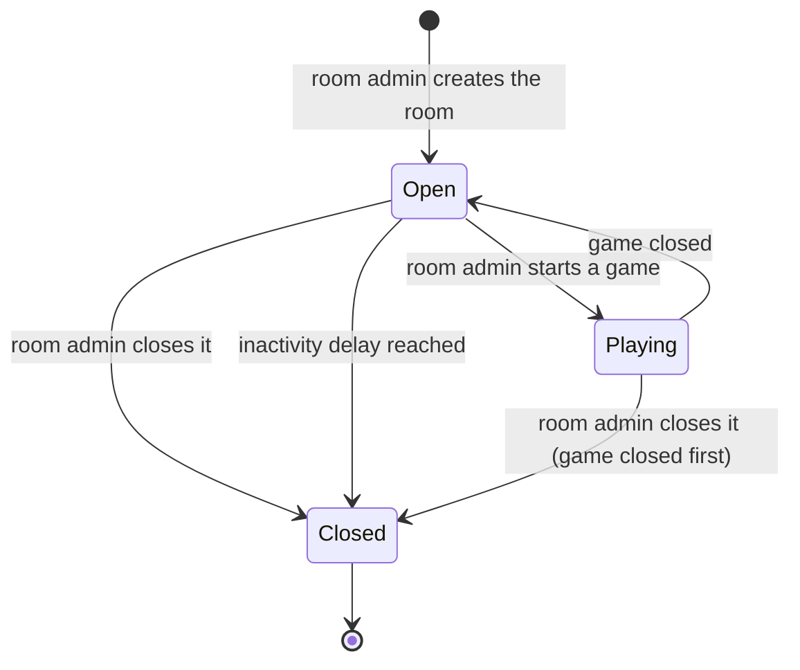
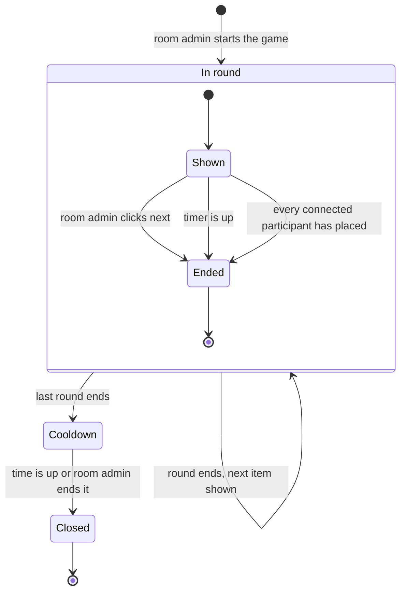
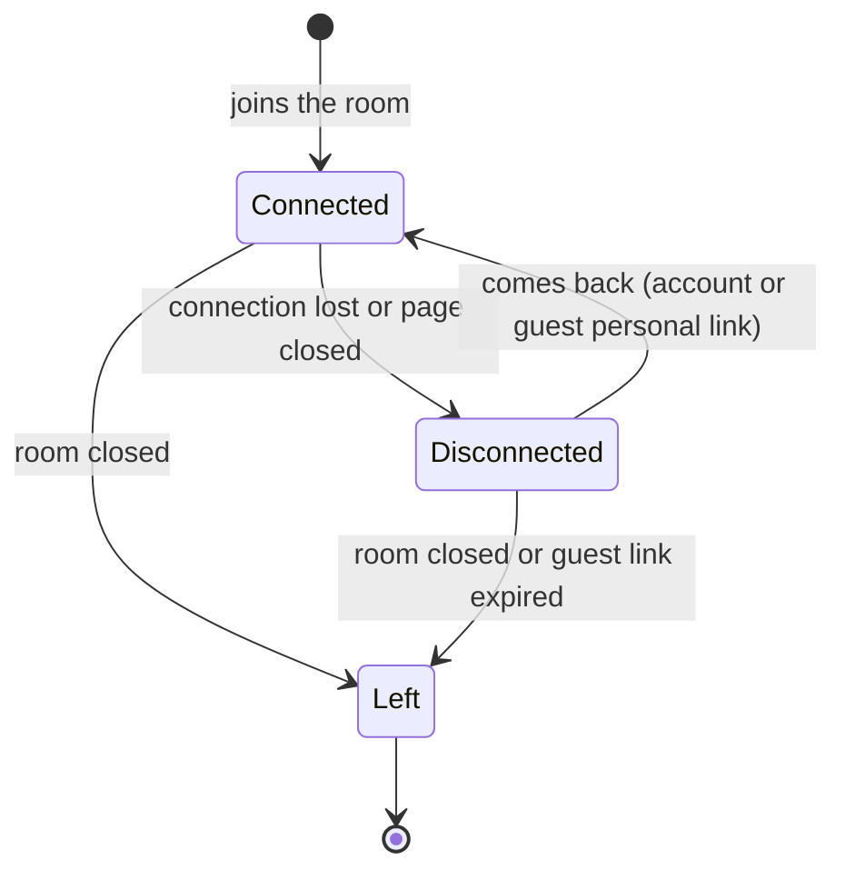

# Milestone 1 — Lifecycles

English | [Français](lifecycles.fr.md)

The states of the main concepts of [milestone 1](README.md) and what moves them from one state to another. Concepts: [domain-model.md](domain-model.md). Stories: [user-stories.md](user-stories.md).

## Room

| State       | Meaning                                                                                                                                         | Who can join                        |
| ----------- | ----------------------------------------------------------------------------------------------------------------------------------------------- | ----------------------------------- |
| **Open**    | The lobby: participants gather, the room admin changes the settings, past results can be viewed.                                                | Anyone with the link or code (≤ 10) |
| **Playing** | A game is in progress. Settings are locked.                                                                                                     | Anyone with the link or code (≤ 10) |
| **Closed**  | Final: the room is **not kept** (link and code gone, guest personal links dead). Only its **games** are kept: history and public results links. | Nobody                              |

| Transition       | Triggered by                                                               | Story          |
| ---------------- | -------------------------------------------------------------------------- | -------------- |
| Open → Playing   | The room admin starts a game.                                              | US-3.1         |
| Playing → Open   | The game is closed (end of the cooldown).                                  | US-5.1         |
| Open → Closed    | The room admin closes the room, or the inactivity delay is reached.        | US-2.7, US-2.8 |
| Playing → Closed | The room admin closes the room after confirming; the game is closed first. | US-2.7         |

## Game

| State        | Meaning                                                                                                                    |
| ------------ | -------------------------------------------------------------------------------------------------------------------------- |
| **In round** | One item is shown; participants place it. Past items cannot be moved.                                                      |
| **Cooldown** | Timed phase: participants move any tile and place the items they missed.                                                   |
| **Closed**   | Rankings are final; results and the public link are available; the game is in the history of participants with an account. |

A game starts directly with its first round: the "lobby" is the **Open** state of the room.

### Round

A round is **Shown** while participants place the item, then **Ended**:

| Round ends when                                     | Condition                              |
| --------------------------------------------------- | -------------------------------------- |
| The room admin clicks "next"                        | Always possible.                       |
| The timer is up                                     | Only with the "timer" setting.         |
| Every **connected** participant has placed the item | Only with the "everyone done" setting. |

When a round ends, every participant without a round placement for the item gets an **absent** placement (US-4.3). After the last round, the game moves to **Cooldown**.

## Participant

| State            | Meaning                                                                                                                    |
| ---------------- | -------------------------------------------------------------------------------------------------------------------------- |
| **Connected**    | Present in the room; takes part in the current round.                                                                      |
| **Disconnected** | Keeps their seat and ranking; gets absent placements for the rounds that end meanwhile; not waited for by "everyone done". |
| **Left**         | The seat is gone (room closed, or guest link expired). Games already closed stay in the history of accounts.               |

A participant who joins **during** a game starts **Connected** at the current round; the past rounds are absent placements for them (US-4.5).
