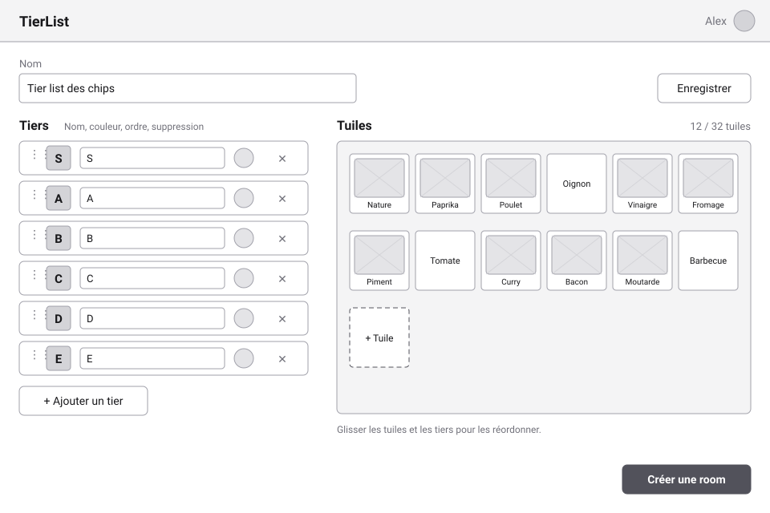
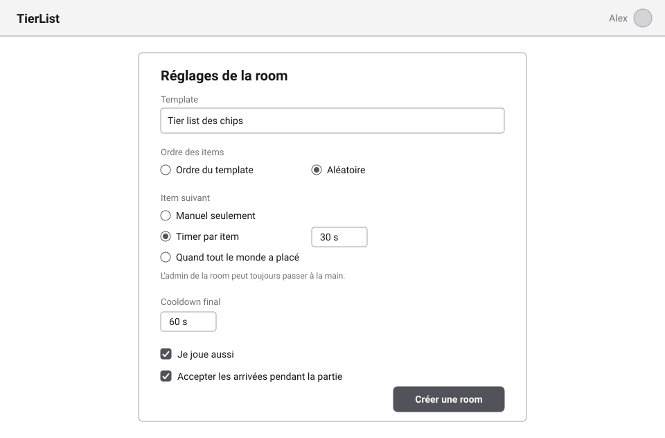
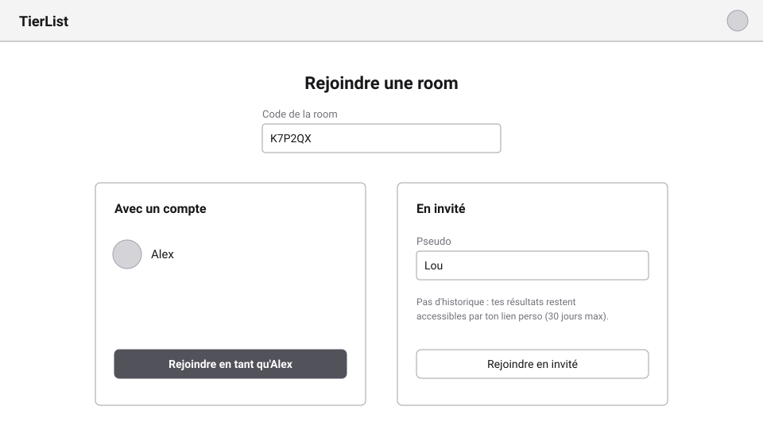
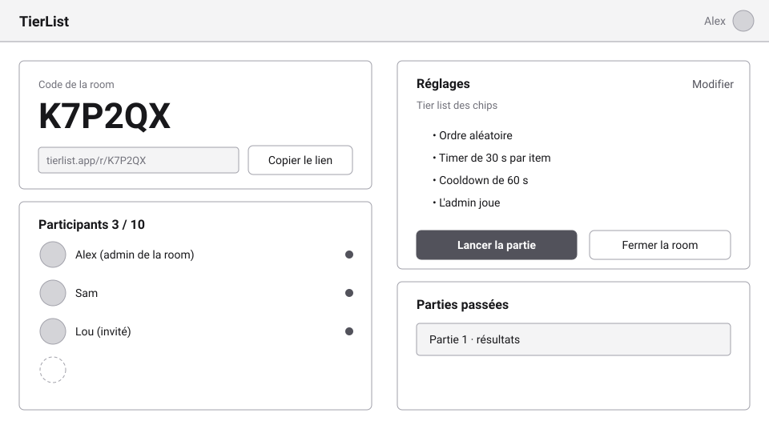
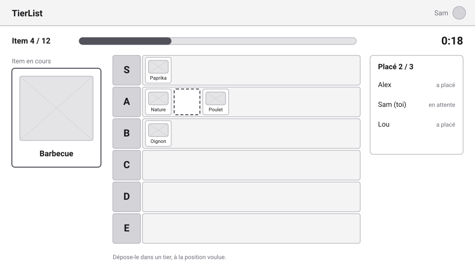
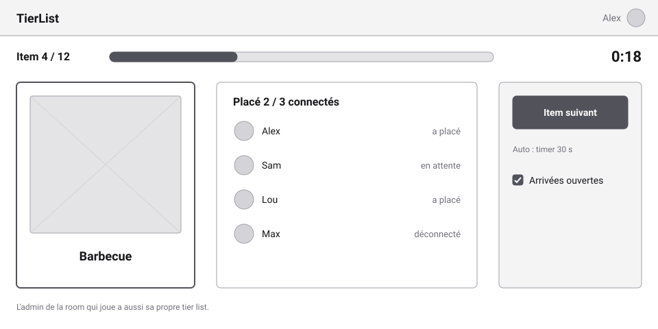
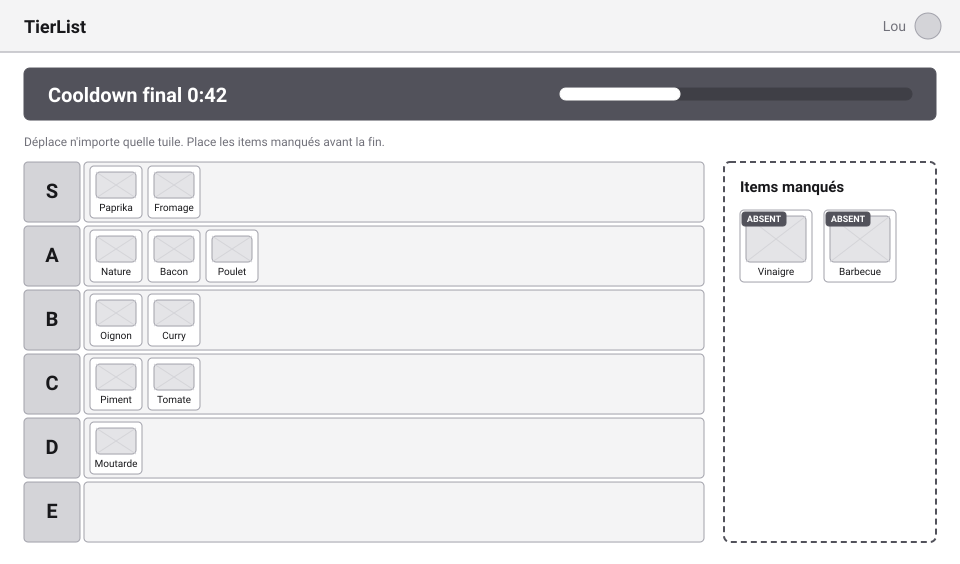
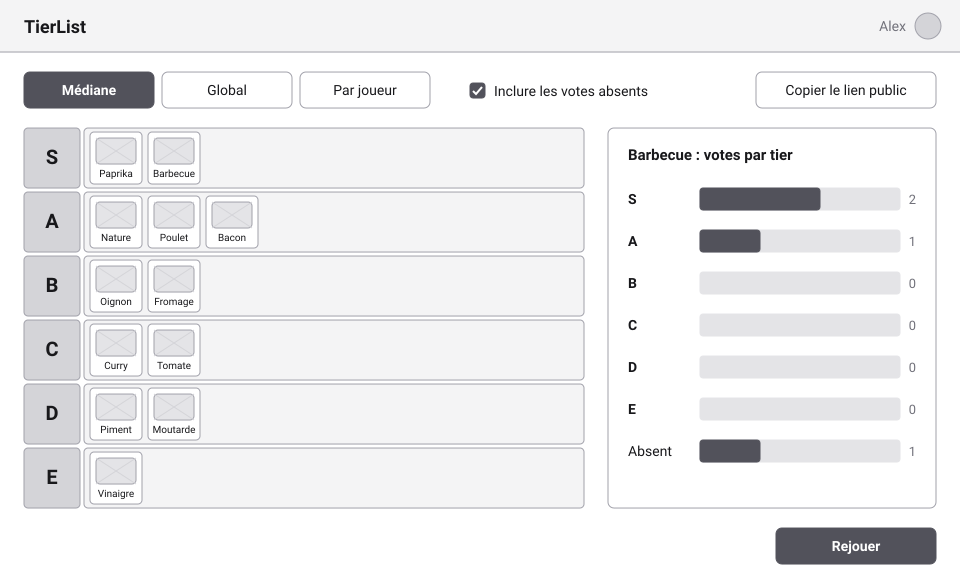

# Jalon 1 — Écrans

[English](screens.md) | Français

Les wireframes basse fidélité des écrans du [jalon 1](README.fr.md). Ils montrent **ce que contient et fait chaque écran**, pas son apparence finale : uniquement du gris, sans couleurs ni charte. La charte graphique se décide plus tard, sur de vrais écrans ([TODO](../../../TODO.fr.md)). Stories : [user-stories.fr.md](user-stories.fr.md).

Chaque image existe en français (affichée ici) et en anglais ([screens.md](screens.md)), dans [screens/](screens/).

## 1. Éditeur de template

- **Stories** : US-1.1 à US-1.4.
- Tiers S à E par défaut ; chacun peut être renommé, recoloré (pastille ronde), réordonné (poignée à gauche) ou supprimé.
- Les tuiles avec image montrent un emplacement d'image ; les tuiles texte seul affichent leur texte. Le compteur montre la limite de **32 tuiles**.
- « Créer une room » mène aux réglages de la room. La liste des templates (US-1.5) est une simple liste avec un état vide ; elle n'est pas dessinée.

## 2. Réglages de la room

- **Stories** : US-2.1, US-2.2.
- Les quatre réglages du jalon. La note rappelle que l'admin de la room peut **toujours** passer à la main.
- Le même formulaire sert à changer les réglages depuis le salon, entre deux parties.

## 3. Rejoindre une room

- **Stories** : US-2.4, US-2.5, US-5.4.
- Ouvrir le lien de la room remplit le code. Connecté, un clic suffit ; sinon, un pseudo suffit.
- L'invité est prévenu qu'il n'a pas d'historique, seulement son **lien perso**.

## 4. Salon

- **Stories** : US-2.3, US-2.6, US-2.7, US-2.9, US-3.1.
- La vue de l'**admin de la room** : code, lien, participants sur 10, résumé des réglages, lancer, fermer, parties passées de la room.
- Les participants voient le même écran sans les actions « Modifier », « Lancer » et « Fermer », et attendent le début de la partie.

## 5. Tour — participant

- **Stories** : US-3.2, US-3.3.
- Numéro de l'item, progression et timer en haut ; l'item en cours à gauche ; la tier list du participant ; qui a placé à droite (**board privé** : jamais où).
- L'emplacement en pointillés montre où l'item va tomber : le **tier et la position** comptent.

## 6. Tour — admin de la room

- **Stories** : US-3.4, US-3.5, US-4.3.
- « Item suivant » est toujours disponible, quel que soit le réglage automatique. Le compteur n'attend que les participants **connectés**.
- Un admin de la room qui joue voit ce panneau **et** sa propre tier list (écran 5).

## 7. Cooldown final

- **Stories** : US-4.1, US-4.2, US-4.6.
- Un bandeau sombre et un compte à rebours donnent l'effet « sous pression ». Toutes les tuiles se déplacent.
- Les items manqués s'affichent à part, marqués **absent**, à placer avant la fin.
- L'admin de la room a aussi un bouton « Terminer » (non dessiné).

## 8. Résultats

- **Stories** : US-5.2, US-5.3, US-2.9.
- Trois vues : classement **médian** (affiché), **global** (répartition par item), **par joueur** (le classement de chaque participant).
- Le panneau de droite montre la répartition de l'item sélectionné, votes **absents** compris ; la case les inclut ou les exclut.
- « Copier le lien public » partage les résultats. La **page publique** montre les mêmes vues, en lecture seule, sans « Rejouer ».
