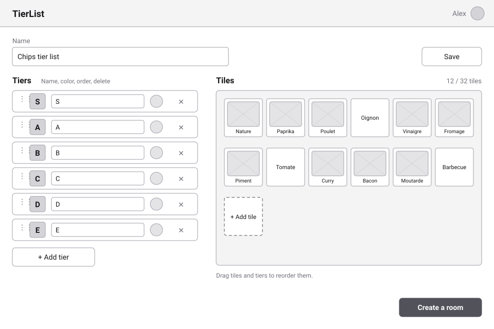
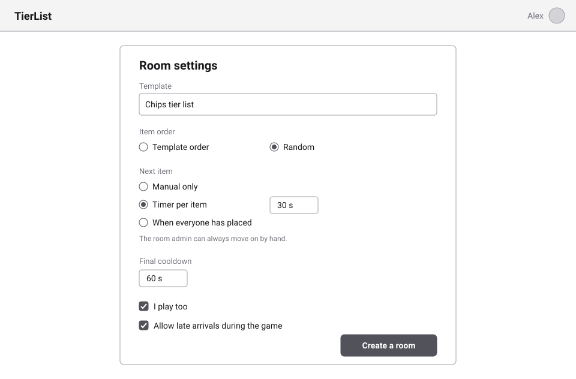
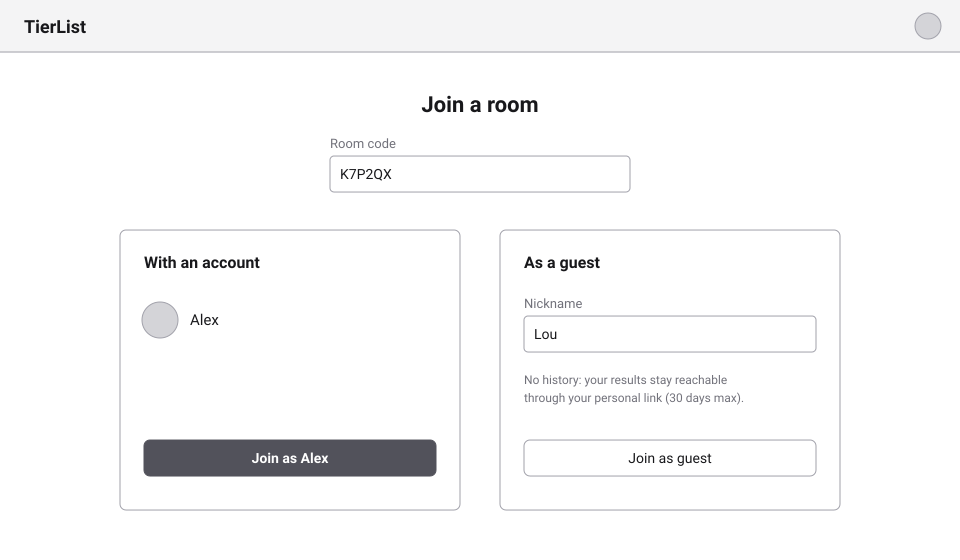
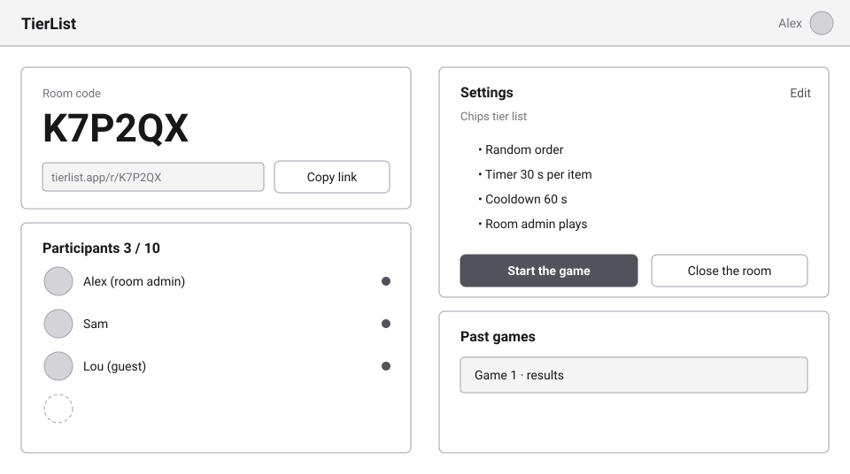
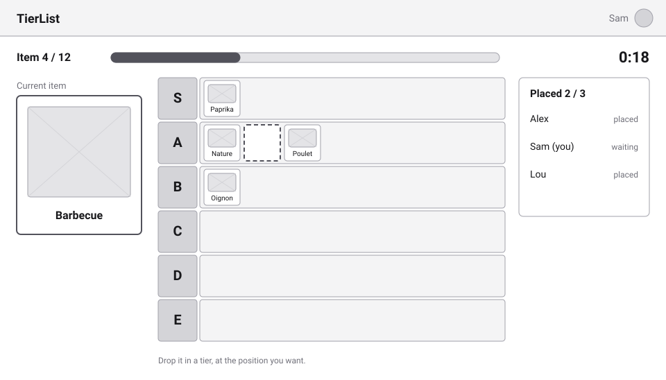
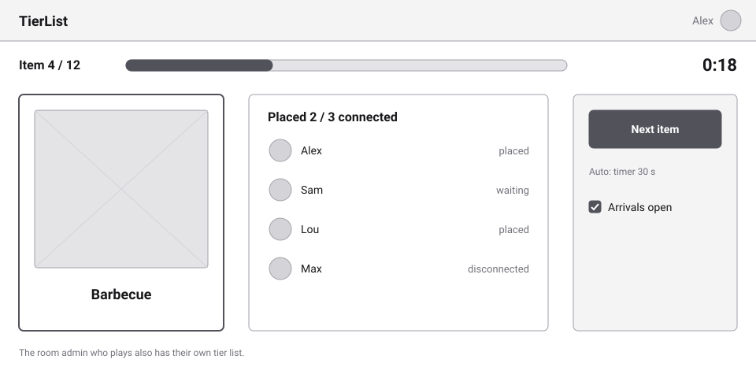
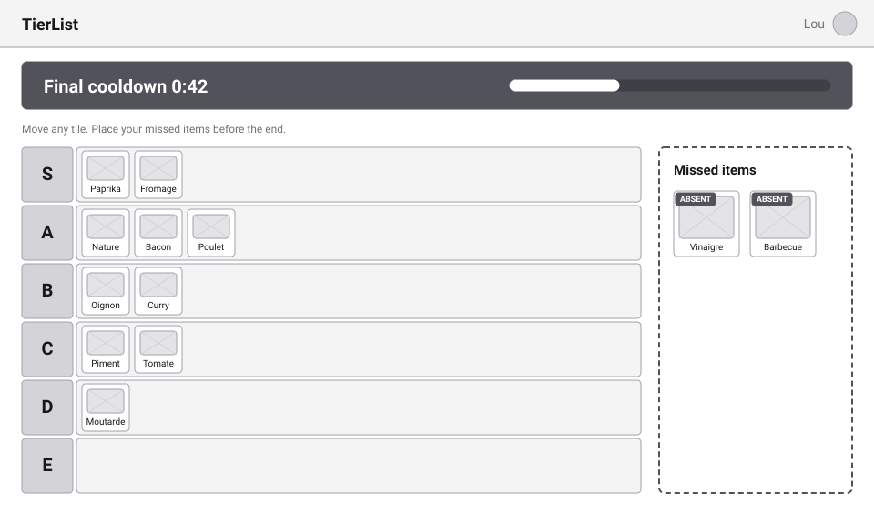
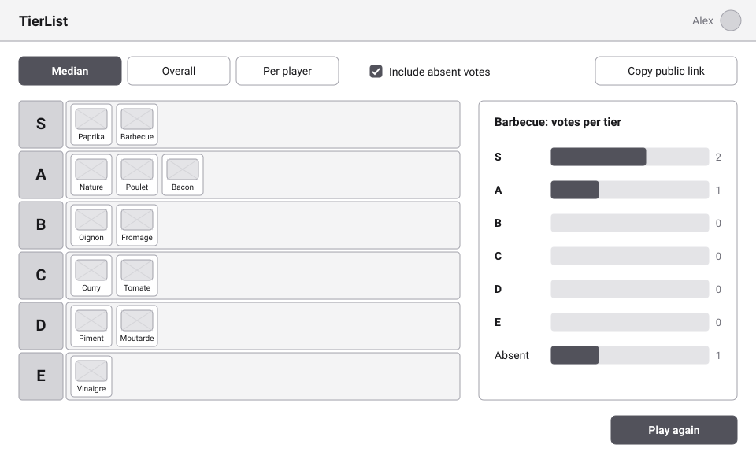

# Milestone 1 — Screens

English | [Français](screens.fr.md)

Low-fidelity wireframes of the screens of [milestone 1](README.md). They show **what each screen contains and does**, not its final look: grey only, no colors, no brand. The visual identity is decided later, on real screens ([TODO](../../../TODO.md)). Stories: [user-stories.md](user-stories.md).

Each image exists in English (shown here) and in French ([screens.fr.md](screens.fr.md)), in [screens/](screens/).

## 1. Template editor

- **Stories**: US-1.1 to US-1.4.
- Tiers S to E by default; each one can be renamed, recolored (round swatch), reordered (handle on the left) or deleted.
- Tiles with an image show a picture placeholder; text-only tiles show their text. The counter shows the **32 tiles** limit.
- "Create a room" leads to the room settings. The list of templates (US-1.5) is a simple list with an empty state; it is not drawn.

## 2. Room settings

- **Stories**: US-2.1, US-2.2.
- The five settings of the milestone. The note reminds that the room admin can **always** move on by hand.
- The same form is used to change the settings from the lobby, between games.

## 3. Join a room

- **Stories**: US-2.4, US-2.5, US-5.4.
- The screen seen **when not signed in**: opening the room link fills the code. "Sign in" brings the user back to the room; otherwise a nickname is enough.
- A **signed-in** user who opens the link does not see this screen: they enter the room directly with their account. Signed-in users can also type the code from the app.
- The guest is told that they have no history: the browser remembers them, and their **personal link** works on any device.

## 4. Lobby

- **Stories**: US-2.3, US-2.6, US-2.7, US-2.9, US-3.1.
- The **room admin's** view: code, link, participants out of 10, settings summary, start, close, past games of the room.
- Participants see the same screen without the "Edit", "Start" and "Close" actions, and wait for the game to start.

## 5. Round — participant

- **Stories**: US-3.2, US-3.3.
- Item number, progress and timer at the top; the current item on the left; the participant's own tier list; who has placed on the right (**private board**: never where).
- The dashed slot shows where the item will land: **tier and position** count.

## 6. Round — room admin

- **Stories**: US-3.4, US-3.5, US-4.3, US-2.10.
- "Next item" is always available, whatever the automatic setting. The counter only waits for **connected** participants.
- "Arrivals open" locks or unlocks late arrivals during the game; participants already in the room can always come back.
- A room admin who plays sees this panel **and** their own tier list (screen 5).

## 7. Final cooldown

- **Stories**: US-4.1, US-4.2, US-4.6.
- A dark banner and a countdown give the "under pressure" feeling. Every tile can be moved.
- Missed items are shown apart, marked **absent**, to be placed before the end.
- The room admin also has an "End now" button (not shown).

## 8. Results

- **Stories**: US-5.2, US-5.3, US-2.9.
- Three views: **median** ranking (shown), **overall** (distribution per item), **per player** (each participant's ranking).
- The right panel shows the distribution of the selected item, including **absent** votes; the checkbox includes or excludes them.
- "Copy public link" shares the results. The **public page** shows the same views, read-only, without "Play again".
